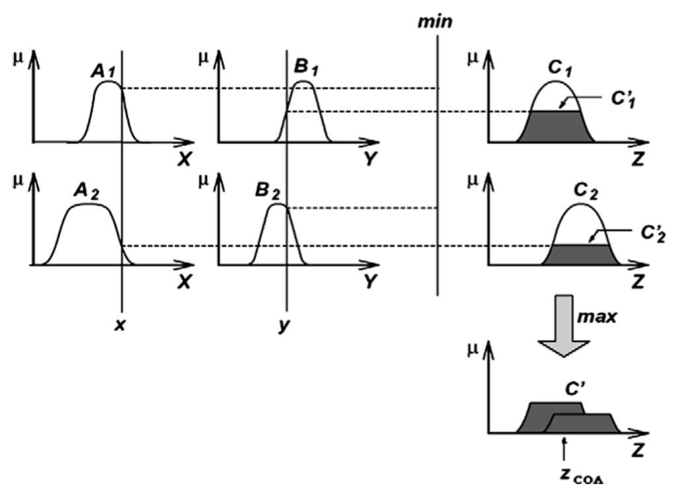
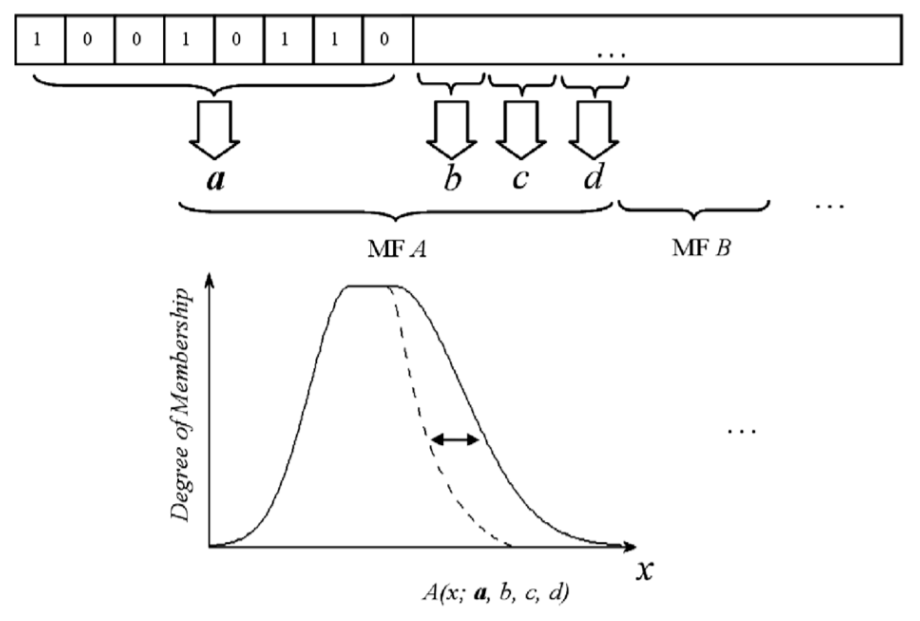

这学期选修了《计算智能》，大作业是阅读论文完成报告，于是记录下读论文的过程。

[A new approach to intrusion detection based on an evolutionary soft computing model using neuro-fuzzy classifiers](http://www.cloudbus.org/~adel/pdf/ccj2007.pdf)

author: Adel Nadjaran Toosi, Mohsen Kahani

# Abstract

An intrusion detection system’s main goal is to classify activities of a system into two major categories: normal and suspicious (intrusive) activities. Intrusion detection systems usually specify the type of attack or classify activities in some specific groups. The objective of this paper is to incorporate several soft computing techniques into the classifying system to detect and classify intrusions from normal behaviors based on the attack type in a computer network. Among the several soft computing paradigms, neuro-fuzzy networks, fuzzy inference approach and genetic algorithms are investigated in this work. A set of parallel neuro-fuzzy classifiers are used to do an initial classification. The fuzzy inference system would then be based on the outputs of neuro-fuzzy classifiers, making final decision of whether the current activity is normal or intrusive. Finally, in order to attain the best result, genetic algorithm optimizes the structure of our fuzzy decision engine. The experiments and evaluations of the proposed method were performed with the KDD Cup 99 intrusion detection dataset.

**Keywords**: Intrusion detection; Soft computing; Neuro-fuzzy; Fuzzy; Genetic algorithm; KDD Cup 99

# 1. Introduction

With the widespread use of computer networks, the number of attacks has grown extensively, and many new hacking tools and intrusive methods have appeared. Using an intrusion detection system (IDS) is one way of dealing with suspicious activities within a network.

An intrusion detection system monitors the activities of a given environment and decides whether these activities are malicious (intrusive) or legitimate (normal) based on system integrity, confidentiality and the availability of information resources. The intrusion detection system collects information about the system being observed. This collected audit data is processed by the detector. The detector eliminates unnecessary information from the audit data and then makes a decision to evaluate the probability that these activities can be considered as a sign of an intrusion[^1][^2].

Soft computing is an innovative approach to construct a computationally intelligent system which parallels the extraordinary ability of the human mind to reason and learn in an environment of uncertainty and imprecision[^3]. Typically, soft computing consists of several computing paradigms, including neural networks, fuzzy sets, approximate reasoning, genetic algorithms, simulated annealing, etc.

Many soft computing approaches have been applied to the intrusion detection field [^4][^5][^6][^8]. In this paper, a novel intrusion detection system based on the integration of a few soft computing methods including neuro-fuzzy, fuzzy and genetic algorithms is described. The key contribution of this work is the utilization of outputs of neuro-fuzzy network as linguistic variables which expresses how reliable current output is.

Fuzzy logic, as a robust soft computing method, has demonstrated its ability in intrusion detection systems[^5][^6][^9][^10][^11]. Moreover, fuzzy systems have several important features which make them suitable for intrusion detection[^9]. Most fuzzy systems make use of human expert knowledge to create their fuzzy rule base and hence lack adaptation, though. Therefore, building fuzzy systems with learning and adaptation capabilities has recently received much attention[^11]. Various methods have been suggested for automatic generation and adjustment of fuzzy rules without using the aid of human experts; the neural fuzzy[^12][^13] and genetic fuzzy are two most successful approaches in this regard[^14][^15].

From the view point of classification, the main work of building an intrusion detection system is to build a classifier that can categorize normal and intrusive event data from the original dataset. ANFIS as an Adaptive neurofuzzy inference system[^13] has the ability to construct models solely based on the target system sample data. This ability among others qualifies ANFIS as a fuzzy classifier for intrusion detection.

The proposed system has different layers which correspond to the needs in various modules of the proposed IDS system. First of all, several neuro-fuzzy classifiers use extracted features of the audit data to classify activities in the network. In this case fuzzy inference system as a decision-making engine based on outputs of the classifiers of previous layer makes the final decision on whether the current activity is normal or intrusive. Finally, genetic algorithms are employed to optimize the structure of fuzzy sets of the fuzzy decision-making engine.

In order to promote the comparison of different works in IDS area, the Lincoln Laboratory at MIT, under the Defense Advanced Research Project Agency (DARPA) and Air Force Research Laboratory (AFRL/SNHS) sponsorship, constructed and distributed the first standard dataset for evaluation of computer network IDS[^16].

Afterward the fifth ACM SIGKDD International Conference on Knowledge Discovery and Data Mining with the purpose of demonstrating the learning contest, collected and generated TCP dump data provided by the aforementioned DARPA in the form of train-and-test sets whose features are defined for the connection records (a connection is a sequence of TCP packets starting and ending at some well-defined times). The main goal of the learning contest was to select classifiers with the best qualifications of recognizing normal and intrusive connections. The above dataset is named as KDD Cup 99 dataset [17] here, and has been used for the experiments.

The subsequent parts of this paper are organized as follows: At first, the related works done by the other researchers is briefly reviewed in Section 2. Section 3 describes KDD Cup 99 dataset on which the experiments are conducted. Then, the next section briefly outlines the basics of fuzzy inference systems and neuro-fuzzy concepts in general and ANFIS (Adaptive Neuro-Fuzzy Inference System) in particular. The last part of this section has been devoted to describing the subtractive clustering technique employed by ANFIS for automatic generation of the initial fuzzy inference system structure. Next, in Sections 5 and 6, the proposed system is explained and experimental results as well as evaluation of the proposed approach are discussed, respectively. Finally, Section 7 makes some concluding remarks and proposes further areas for future research.

# 2. Related work

There were a total of 24 <u>entries（参赛者）</u> submitted to the KDD Cup 99 contest. All the top three winners’ approaches use some variants（变种） of decision trees. The KDD’99 contest winner entry made use of an ensemble of 50*10 C5 decision trees, using cost-sensitive bagged boosting[^18]. The runner-up entry also used decision trees. A set of decision trees was constructed. Then a problem-specific global optimization criterion（针对特定问题的全局优化准则） was used to select optimal subset of trees to give the final prediction[^19]. The third-placed approach used two-layer decision trees. The first layer was trained on the connections which cannot be classified by security experts, whereas the second layer was built on the connections which cannot be classified by the first layer[^20].

Thereafter, other approaches on the classification problem of KDD Cup 99 have emerged. One of the successful approaches based on data-mining framework used RIPPER rules which have been presented by Lee et al.[^21]. Association rules and Frequent Episodes algorithms（关联规则和频繁集算法） have been used to derive correlations（相关性） between features and represent the sequentially（顺序） of audit records, respectively. Agarwal and Joshi proposed a framework for learning a rule-based model (PNrule) to make classifier models on a dataset that has widely different class distributions in training data[^22].

There are some works in which the performance of different machine learning algorithms and classification techniques were compared based on the KDD Cup 99 dataset. Sabhnani and Serpen analyzed the performance of comprehensive set of pattern recognition and machine learning algorithms according to the above dataset. Experiments outcomes show that a specific classification algorithm performs better for certain attack categories. The present fact（目前的事实） was a motivation（促进） for the authors to use a multi-classifier model which utilizes different classifiers for each specific attack category of KDD dataset[^23].

Recently, soft computing approaches are used for intrusion detection systems. Some of these methods have been evaluated on KDD dataset. Fuzzy rule-based classifiers, decision trees, support vector machines, linear genetic programming（线性遗传规划 ）have been used in[^8] by Abraham and Jain to illustrate the importance of soft computing paradigm for modeling（建模） intrusion detection systems. Abadeh et al. describe a fuzzy genetics-based learning algorithm and discuss its usage for intrusion detection in network[^11]. Their experiments were performed on KDD dataset. Another work which utilizes genetic algorithm for incorporating（合并） the capability of learning to fuzzy rules is the work of Gomez and Dasgupta[^5]. Genetic programming based on RSSDSS algorithm for dynamically filtering the dataset is another technique which exists in this area[^4]. It’s important to note that this model detects whether or not a record is intrusive（是否有入侵性） not if attack records belong to a specific attack category（而不是是否属于一种特定的攻击类别）.

Yeung and Chow proposed a novel detection approach using non-parametric density estimation（非参数密度估计） based on ParzenWindow estimator with Gaussian kernels to build an anomaly（异常） intrusion detection system[^25]. This model also only detects whether the current record is an intrusion or not.

It seems necessary to cite the works that criticize many aspects of the DARPA evaluation dataset[^26][^27]. McHugh[^26], with respect to the collected traffic data by DARPA, criticizes the lack of statistical evidence of similarity to the typical Air Force network traffic, low traffic rates, relative uniform distribution of the four major attack categories, skewed（歪曲的） distribution of victim hosts, and flat network topology（平面网络拓扑）. More detailed analysis of this dataset which is made by Mahoney and Chan confirms McHugh’s criticism that the data is of statistically different characteristics from the real traffic. They also suggest an approach to mitigate（缓解） the problem[^27]. However, it is difficult to employ such solutions for the KDD Cup dataset. Moreover, since this work should be compared with other works in this area and certainly should be respectful to the experimental conditions of other compared works, the original KDD dataset have been used for the experiments.

# 3. KDD Cup 99 dataset

The KDD Cup 99 dataset includes a set of 41 features derived from each connection and a label which specifies the status of connection records as either normal or specific attack type. The list of these features can be found in Appendix A. These features had all forms of continuous, discrete, and symbolic, with significantly varying ranges falling in four categories（这些特征具有连续、离散和象征性的所有形式，显著的变化范围分为四类）[^17]:

- The first category consists of the *intrinsic* features of a connection, which include the basic features of individual TCP connections. The duration（持续） of the connection, the type of the protocol (TCP, UDP, etc.), and network service (http, telnet, etc.) are some of the features.
- The *content* features within a connection suggested by domain knowledge are used to assess the payload of the original TCP packets, such as the number of failed login attempts.
- The *same host* features examine established connections in the past two seconds that have the same destination host as the current connection, and calculate the statistics related to the protocol behavior, service, etc.
- The *similar same service* features inspect the connections in the past two seconds that have the same service as the current connection.

Likewise, attacks fall into four main categories[^17]:

- DoS (Denial of Service): making some computing or memory resources too busy to accept legitimate users access these resources.
- R2L (Remote to Local): unauthorized access from a remote machine in order to exploit machine’s vulnerabilities.
- U2R (User to Root): unauthorized access to local superuser (root) privileges using system’s susceptibility.
- Probe: host and port scans as precursors to other attacks. An attacker scans a network to gather information or find known vulnerabilities.

KDD dataset is divided into training and testing record sets. Total number of connection records in the training dataset is about 5 million records. This is too large for our purpose; as such, only concise（简洁的） training dataset of KDD, known as 10% training dataset, was employed here. The distribution of normal and attack types of connection records in this subset have been summarized in Table 1.

As it can be seen in Table 1, sample distributions for different categories of attacks in training data differ significantly from each other. One of the main contributions of this work is to overcome this issue by using different classifier for each class of data.

The test data enjoys a different distribution. Moreover, the test data includes additional attack types not present in the training data which makes classifying more complicated. Table 2 summarizes the distribution of normal and attack types of connection records in the test dataset. And Table 3, based on major types of attack, shows the sample distribution of the new attacks in the test dataset. New attacks refer to those which were not present in the training dataset, but exist in the test dataset.

#### Table 1

The sample distributions on the subset of 10% data of KDD Cup 99 dataset

| Class  | Number of samples | Samples percent (%) |
| ------ | ----------------- | ------------------- |
| Normal | 97277             | 19.69               |
| Probe  | 4107              | 0.83                |
| DoS    | 391458            | 79.24               |
| U2R    | 52                | 0.01                |
| R2L    | 1126              | 0.23                |
|        | 492021            | 100                 |

#### Table 2

The sample distributions on the test data with the corrected labels ofKDD Cup 99 dataset

| Class  | Number ofsamples | Samples  percent (%) |
| ------ | ---------------- | -------------------- |
| Normal | 60593            | 19.48                |
| Probe  | 4166             | 1.34                 |
| DoS    | 229853           | 73.90                |
| U2R    | 228              | 0.07                 |
| R2L    | 16189            | 5.20                 |
|        | 311029           | 100                  |

#### Table 3

The new attacks sample distributions on the test data with the corrected labels of KDD Cup 99 dataset

| Class | Number of novel attack samples | Total number of samples | Samples percent (%) |
| :---: | :----------------------------: | :---------------------: | :-----------------: |
| Probe |              1789              |          4166           |         43          |
|  DoS  |              6555              |         229853          |          3          |
|  U2R  |              189               |           228           |         83          |
|  R2L  |             10196              |          16189          |         63          |
|       |             18729              |         250436          |         7.5         |

Fig. 1. The Mamdani fuzzy inference system using min and max for T-norm and T-conorm operators, respectively[^13].

# 4. Fuzzy and neuro-fuzzy

## 4.1. Fuzzy inference system (FIS)

The past few years have witnessed a rapid growth in the number and variety of applications of fuzzy logic. Among various combinations of methodologies in soft computing, the one that has the highest visibility is that of fuzzy logic and neuro computing, leading to so-called neuro-fuzzy systems. An effective method developed by Jang for this purpose is called ANFIS (Adaptive neuro-fuzzy inference system)[^13].

The basic structure of most Fuzzy inference systems (FISs) that we have seen so far is a model that maps the input characteristics to the input Membership functions (MF). Three well-known types of FIS are employed in various systems. The *Mamdani Fuzzy Model*[^24] was proposed as the very first attempt to map an input to an output space on top of the experiences of experts.

An example of two-input single-output Mamdani fuzzy model with two rules can be expressed as

$$
if\ x\ is\ A1\ and\ y\ is\ B1\ then\ z\ is\ C1,
$$

$$
if\ x\ is\ A2\ and\ y\ is\ B2\ then\ z\ is\ C2,
$$

where A and B are fuzzy sets of inputs with membership functions of A1, A2 and B1, B2, respectively, and C is the fuzzy output set.

Max and min as the choice for T-norm and T-conorm operator are adopted here, respectively. The resulting fuzzy reasoning is shown in Fig. 1. For more acquaintance with T-norm and T-conorm, and inference system of Mamdani fuzzy models the readers may refer to[^13].

Since usual systems take only crisp values, we should use a defuzzifier to convert a fuzzy set to a crisp value. (Defuzzification refers to the way a crisp value is extracted from a fuzzy set as a representative value[^13].) We use centroid of area defuzzification strategy to convert the output to a crisp value. An explanation of centroid of area defuzzification strategy is shown below. Centroid of area $Z_{COA}$ is:

$$
Z_{COA}=\frac{\int_Z\mu_A(z)z\mathrm{d}t}{\int_Z\mu_A(z)\mathrm{d}t}
$$
where $\mu A(z)$ is the aggregated output MF.

Before introducing the structure of ANFIS as our main classifier, it is important to mention that Mamdani fuzzy inference system (FIS) has been used for the final decision-making module. More details on structure of the system and decision-making engine will be explored at later sections.

In an effort to develop a systematic approach to generate fuzzy rules from a given input–output dataset, Takagi, Sugeno, and Kang proposed TSK Fuzzy Model (known as the Sugeno Fuzzy Model)[^28]. A fuzzy rule in a Sugeno fuzzy model has the form of,
$$
if\ is\ A\ and\ y\ is\ B\ then\ z\ = f(x,y),
$$
where A and B are input fuzzy sets in antecedent and usually $z = f(x,y)$ a zero- or first-order polynomial function（零阶或一阶多项式函数） in the consequent（结果）.

Fuzzy reasoning procedure for the first order Sugeno fuzzy model is shown in Fig. 2a. Here, defuzzification procedure in the Mamdani fuzzy model is replaced by the operation of weighted average（加权平均运算） in order to avoid the timeconsuming procedure of the former（避免了前者耗时的过程）[^13].

Fig. 2. (a) The Sugeno fuzzy model reasoning; (b) equivalent ANFIS structure[^13].

## 4.2. Adaptive neuro-fuzzy inference system (ANFIS)

There are some modeling situations in which one cannot just look at the data and decides on the shape of membership functions. Rather than choosing the parameters associated with a given membership function arbitrarily（武断地）, these parameters could be chosen so that they tailor（改变） the membership functions <u>to the variation in the input/output data（根据输入/输出的变化）</u> in order to account for these types of variations in the data values. This is where the so-called neuro-adaptive learning technique incorporated into ANFIS can help.

Assume a Fuzzy inference system with two inputs x, y and one output z with the first order of Sugeno Fuzzy Model. Fuzzy rule set with two fuzzy if–then rules is as follows:
$$
if\ x\ is\ A1\ and\ y\ is\ B1,\ then\ f1 = p1x + q1y + r1,
$$

$$
if\ x\ is\ A2\ and\ y\ is\ B2,\ then\ f2 = p2x + q2y + r2;
$$

Fig. 2a illustrates the reasoning mechanism（推理机制） for this Sugeno model.

As it is shown in Fig. 2b, the reasoning mechanism can be implemented into a feed-forward neural network with supervised learning capability, which is known as ANFIS architecture.

The square and circle nodes（方形和圆形节点） are for <u>adaptive nodes with parameters（有参数的自适应节点）</u> and <u>fixed nodes without parameters（无参数的固定节点）</u>, respectively. The first layer consists of square nodes that perform fuzzification with chosen membership function. The parameters in this layer are called <u>premise parameters（前提参数）</u>. In the second layer, the T-norm operation is performed to produce the firing strength of each rule. The ratio of the ith rule firing strengthtothesumofallrules’firingstrengthiscalculatedin the third layer, generating the normalized firing strengths（产生每个规则的射击强度）. The fourth layer consists of square nodes that perform <u>multiplication（乘法）</u> of <u>normalized firing strengths（标准射击强度）</u> with the <u>corresponding rule（相应规则）</u>. The parameters in this layer are called consequent parameters. The <u>overall output（总输出）</u> is calculated by the sum of all incoming signals in the fifth layer[^13].

ANFIS provides a method for the fuzzy modeling procedure to learn information about a dataset in order to compute the membership function parameters that best allow the associated Fuzzy inference system to track the given input/output data. This learning method works similarly to that of neural networks. The parameters associated with the membership functions will change through the learning process. ANFIS uses either <u>back propagation（反向传播）</u> or a <u>combination（组合）</u> of <u>least square estimations（最小二乘估计）</u> and back propagation for membership function parameter estimations. The readers are referred to[^13] for more details on these methods.

## 4.3. <u>Subtractive clustering（减法聚类）</u>

The purpose of clustering is to identify natural groupings of data from a large dataset to produce a concise representation of a system’s behavior. It is possible to use the cluster information to generate a Sugeno-type fuzzy inference system that best models the data behavior using a minimum number of rules. The rules partition themselves according to the fuzzy qualities associated with each of the data clusters.

Assume a 2-D training dataset (including input and desired output) and cluster center (xi,yi). The ith rule can be expressed in the form of
$$
if\ X\ is\ close\ to\ x_i,\ then\ Y\ is\ close\ to\ y_i,
$$
After the structure is determined, back propagation or gradient decent and other optimization schemes can be applied to proceed with parameter identification.

However, before the start of the ANFIS training, the fuzzy inference system should be generated. FIS generation can implement in <u>grid partitioning（网格划分）</u> or subtractive clustering. In grid partitioning, all the possible rules are generated based on the number of MFs for each input. For example, in a two dimensional input space with three MFs in the input sets, the number of rules in grid partitioning results in 9 rules. This partitioning strategy needs only a small number of MFs for each input and encounters problems when we have moderately a large number of each input. So we use subtractive clustering to determine the number of rules, and the initial points of the membership functions.

Suppose that there is not a clear idea of how many clusters there should be for a given set of data. Subtractive clustering[^29]is a fast one-pass algorithm for estimating the number of clusters and the cluster centers in a set of data. This method is used here, and it is an extension of the Mountain clustering method proposed by Yager and Filev[^30].

Consider a collection of m data points {x1,...,xm} in an N-dimensional space. Subtractive clustering assumes each data point as a potential cluster center and calculates a measure of the potential for each data point based on the <u>density（密度）</u> of surrounding data points. Density measure at data point xj is calculated as follows:

$$
D_j=\sum_{i=1}^m\exp(-\frac{|x_j-x_i|^2}{(r_a/2)^2})
$$
where ra is a positive constant value and it defines the neighborhood <u>radius（半径）</u>. The algorithm selects the data point with the highest density measure as the first cluster center and then <u>eradicates（消除）</u> the potential of data points near the first cluster center. The algorithm then selects the data point with the highest remaining potential (next highest density measure has been remained) as the next cluster center and eradicates the potential of data points near this new cluster center. This process of acquiring a new cluster center and eradicating the potential of surrounding data points repeats until the potential of all data points <u>fall below a threshold（落到阈值以下）</u>. The range of influence of a cluster center in each of the data dimensions is called cluster radius. The cluster radius <u>indicates（指示）</u> the range of influence of a cluster when you consider the data space as a single hypercube. A small cluster radius will lead to find many small clusters in the data (resulting in many rules) and <u>vice versa（反之亦然）</u>.

The clusters’ information obtained by this method is used for determining the initial number of rules and <u>antecedent （先前的）</u>membership functions, which is used for identifying the FIS. An important advantage of using a clustering method to find rules is that the resulting rules are more <u>tailored（定做的，引申为适合）</u> to the input data than they are in an FIS generated without clustering. In this study, we use Subtractive clustering has been used to determine the number of rules and antecedent membership functions. So one can obtain a FIS structure that contains a set of fuzzy rules to <u>cover the feature space（覆盖特征空间）</u>.

# 5. Proposed system

The principle motivation for this work was to provide a framework for using soft computing approaches to build a classifier that can act better than single algorithm using a single soft computing approach, e.g., neuro-fuzzy. The proposed system is discussed in details in this section. First, the system architecture is explained. Then, data sources, selected from KDD for training the system, are introduced. Afterward, layers of proposed framework are presented in more details.

## 5.1. System architecture

The proposed architecture for the Evolutionary Soft Computing Intrusion Detection System includes two layers. In the first layer, there are five ANFIS modules which are trained to explore the intrusive activity from the input data. Each ANFIS module belongs to one of the classes in the dataset each providing an output which specifies the degree of relativity of the data to the specific class 1 shows total membership while 1 is used otherwise. (It is important to mention that the ANFIS structure has only one output.) The most important motivation to using ANFIS in this way is that ANFIS is usually more appropriate as a <u>binary classifier（二进制分类器）</u> rather than a multi-classifier[^31].

Second, a Fuzzy Inference module, based on <u>empirical knowledge（经验知识）</u>, is employed to make the final decision for recognition. The fuzzy inference module implements nonlinear mappings from the outputs of the neuro-fuzzy classifiers of the pervious layer to the final output space which specifies if the input data are normal or intrusive. Afterward, if the system recognizes that the current pattern is intrusive by nature, the classifier of the first layer, in which the output is the nearest value among all classifiers, specifies the class of the attack.

In order to attain the best results, genetic algorithm (GA) is used to optimize the structure of the fuzzy decision-making engine. The GA structure is discussed in more depth later. Fig. 3 depicts the schematic block diagram of the proposed system architecture.

Fig. 3. System architecture block diagram.

## 5.2. The data sources

All of the above features have been applied to the inputs of the five neuro-fuzzy classifiers. From the classification point of view, any system mainly consists of two phases: (1) the training of the parameters of the classifier according to the training dataset and (2) using the classifier to categorize a test dataset. Here, 10% of the training dataset was used as the source of the training dataset. Since the number of records in the 10% dataset was still very large for our purposes, different subsets of the training and checking dataset were randomly selected from the subset of 10% of data, for the training phase. The basic idea behind using a checking dataset for model validation is that after a certain point in training, the model begins <u>overfitting（过度拟合）</u> the training dataset. If overfitting does occur, we cannot expect the classifier to respond well to other independent datasets. In fact, if checking data is used for ANFIS training, <u>the final FIS associated with the minimum checking error（与最小检查误差相关联的最终FIS）</u> will be chosen.

Results of different machine learning algorithms show that <u>anomaly detectors（异常检测器）</u> do better than <u>signature-based（基于特征的）</u> detectors for KDD Cup 99 dataset[^33]. This might be because the testing data has <u>substantial（大量）</u> new attacks with signatures not correlated with similar attacks in the training data. On the other hand, the number of training samples for signature-based detectors seems not to be <u>ample（充足）</u> to develop classifiers to function as efficiently as possible. The attack samples in the testing dataset, though, have <u>rather enough deviation（相当大的差别）</u> from normal or regular samples in the training dataset[^4][^25].

Since each classifier in first layer of the system acts as a signature based classifiers and the goal is to select a good training and checking dataset for the learning phase, training and checking dataset has been selected, as shown on the Tables 4 and 5, <u>wherein（其中）</u> numbers of samples in the normal class are approximately equal to the summation of the samples in the other classes. By this policy, in view of the fact that each classifier performs as binary classifier (current activity belongs to this class or not), each classifier <u>somehow（以某种方式）</u> acts as an anomaly detector system.

The distribution of the samples in the two subsets that were used for the training is listed on Tables 4 and 5. Selected subsets <u>enjoy（具有）</u> different numbers of samples, the smaller one contains a few number of samples to show the system is still capable, despite the fact that a small portion of the training data has been used. The other one in more number of samples enjoys more number of samples to illustrate efficiency of proposed system as much as possible.

Due to the reduction of <u>random sampling effects（随机抽样效应）</u>, <u>10 trails with the same distribution（10各项同分布的实验）</u>, have been selected for each subset of trainings (training sets in Tables 4 and 5). Therefore, all the <u>evaluation（评估）</u> results in the latter parts of the paper have been computed <u>over（在...之上）</u> these ten trials except those <u>explicitly（确切）</u> mentioned.

Before concluding this subsection, it should be mentioned that to be fair, we did not have any access to the testing dataset during the training and optimization phase. Moreover, the standard conditions of the KDD Cup competition has been deployed.

## 5.3. The neuro-fuzzy classifiers

The subtractive clustering method with ra = 0.5 (neighborhood radius) has been used to partition the training sets and generate an FIS structure for each ANFIS. For further fine-tuning and adaptation of membership functions, training sets were used for training ANFIS. Each ANFIS trains at 50 <u>epochs（阶段）</u> of learning and final FIS that is associated with the <u>minimum checking error（最小检测误差）</u> has been chosen. All the MFs of the input and output fuzzy sets were selected in the form of Gaussian functions with two parameters.

## 5.4. The fuzzy decision module

The fuzzy inference module has five inputs, obtained from the output values of each ANFIS classifiers. The fuzzy inference module, based on these inputs, determines whether the current connection record is an attack or not. A <u>five-input, single-output（五输入单输出）</u> of Mamdani fuzzy inference system with <u>centroid of area defuzzification strategy（面积质心解模糊策略）</u> was used for this purpose. Each input fuzzy set includes two MFs and all the MFs are <u>Gaussian functions which are specified by four parameters（由四个参数指定的高斯函数）</u>. The proposed fuzzy inference module uses the rules shown in the fuzzy associative memory in Table 6.

The output of the fuzzy inference engine, which varies between 1 and 1, specifies how intrusive the current record is, 1 to show completely intrusive and 1 for completely normal. Records <u>with positive intrusive values（有正侵入值）</u> are selected as intrusive patterns. After an attack is detected, <u>its class is selected based on the ANFIS module class which returns the highest value（根据返回最大值的ANFIS模块类别来选择其类别）</u>.

Table 4

Sample distributions on the First Training and Checking data randomly selected of 10% data of KDD Cup 99 dataset

|         |          | Normal | Probe | DoS   | U2R  | R2L  | Total |
| ------- | -------- | ------ | ----- | ----- | ---- | ---- | ----- |
| ANFIS-N | Training | 20000  | 4000  | 15000 | 40   | 1000 | 40040 |
|         | Checking | 2500   | 107   | 2000  | 12   | 126  | 7245  |
| ANFIS-P | Training | 10000  | 4000  | 5000  | 40   | 1000 | 16040 |
|         | Checking | 1000   | 107   | 500   | 12   | 126  | 10245 |
| ANFIS-D | Training | 25000  | 4000  | 20000 | 40   | 1000 | 25040 |
|         | Checking | 6000   | 107   | 5000  | 12   | 126  | 10254 |
| ANFIS-U | Training | 200    | 50    | 50    | 46   | 50   | 246   |
|         | Checking | 100    | 25    | 25    | 6    | 25   | 181   |
| ANFIS-R | Training | 4000   | 1000  | 2000  | 40   | 1000 | 6040  |
|         | Checking | 2000   | 500   | 1000  | 12   | 126  | 3138  |

Table 5

Distribution of samples on the Second Training and Checking data randomly selected of 10% data of KDD Cup 99 dataset

|         |          | Normal | Probe | DoS  | U2R  | R2L  | Total |
| ------- | -------- | ------ | ----- | ---- | ---- | ---- | ----- |
| ANFIS-N | Training | 1500   | 500   | 500  | 52   | 500  | 3052  |
|         | Checking | 1500   | 500   | 500  | 0    | 500  | 3000  |
| ANFIS-P | Training | 1500   | 500   | 500  | 52   | 500  | 3052  |
|         | Checking | 1500   | 500   | 500  | 0    | 500  | 3000  |
| ANFIS-D | Training | 1500   | 500   | 500  | 52   | 500  | 3052  |
|         | Checking | 1500   | 500   | 500  | 0    | 500  | 3000  |
| ANFIS-U | Training | 1500   | 500   | 500  | 46   | 500  | 3046  |
|         | Checking | 1500   | 500   | 500  | 6    | 500  | 3006  |
| ANFIS-R | Training | 1500   | 500   | 500  | 52   | 500  | 3052  |
|         | Checking | 1500   | 500   | 500  | 0    | 500  | 3000  |

Table 6

Fuzzy associative memory for the proposed fuzzy inference rules

| Normal | PROBE |  DoS  |  U2R  |  R2L  | Output |
| :----: | :---: | :---: | :---: | :---: | :----: |
|  High  |   -   |   -   |   -   |   -   | Normal |
|   -    | -High | -High | -High | -High | Normal |
|        | High  |   -   |   -   |   -   | Attack |
|   -    |   -   | High  |   -   |   -   | Attack |
|   -    |   -   |   -   | High  |   -   | Attack |
|   -    |   -   |   -   |   -   | High  | Attack |
|  Low   |   -   |   -   |   -   |   -   | Attack |
|   -    |  Low  |  Low  |  Low  |  Low  | Normal |

## 5.5. The Genetic algorithm module

Genetic algorithm is a method for solving optimization problems that are based on <u>natural selection（自然选择）</u> – a process that <u>derives from biological evolution（从生物进化中衍生出来）</u>[^32]. The genetic algorithm repeatedly modifies <u>a population（一个种群）</u> (a set of individuals) by <u>a set of genetic operators（一组遗传算子）</u> including <u>mutation（变异）</u>, <u>crossover（交叉）</u>, and selection. It selects individuals <u>evolving（进化）</u> <u>toward an optimal solution（朝着最佳解决方案）</u> from the current population and uses them to produce children of the next generation. The algorithm stops when the stopping <u>criterion（标准）</u> is met. In the proposed system, each individual (chromosome) has genes codifying parameters of the MFs of the input fuzzy set of the fuzzy decision engine. A chromosome consists of 320 bits of binary data. Each 8 bits of a chromosome determines one parameter out of the four parameters of an MF. Fig. 4 illustrates the decoding process of each individual chromosome.

The genetic algorithm, which is used here to optimize the input MFs of the fuzzy decision-making module, uses a subset selected from 10% of KDD dataset for the optimization process. The distribution of samples for this subset is shown in Table 7.

In view of the fact that <u>GA optimization process（遗传算法优化过程）</u> does not always provide <u>an identical（一模一样）</u>, the optimization phase was performed three times and the average of the experiments results was computed for each attained structures. Also, due to the reduction of the effects of randomly sampling, five different trails of subsets – <u>not overlapping with each other（彼此之间不相互重叠）</u> – have been used for this phase.

The fitness function <u>evaluates the fitness value for each individual（评估每个个体的适应度值）</u>. Fundamentally, the fitness function is the function that should be optimized. This works considers two different fitness functions.

Before discussing more about the fitness functions, it seems necessary to talk about standard metrics that has been developed for evaluating network intrusion detections. Detection rate and false alarm rate are the two most famous metrics that have already been used. Detection rate is computed as the ratio between the number of correctly detected attacks and the total number of attacks, while false alarm (false positive) rate is computed as the ratio between the number of normal connections that is incorrectly misclassified as attacks and the total number of normal connections. Another metric used here is the classification rate. Classification rate for each class of data is defined as the ratio between the number of test instances correctly classified and the total number of test instances of this class.

For the purpose of classifier algorithm evaluation, another comparative measure is defined which is Cost Per Example (CPE)[^23].

CPE is calculated using the following formula:

where CM and C are <u>confusion matrix（混淆矩阵）</u> and <u>Cost Matrix（成本矩阵）</u>, respectively, and N represents the total number of test instances, m is the number of the classes in classification. A confusion matrix is a square matrix in which each column corresponds to the <u>predicted class（预测类）</u>, while rows correspond to the <u>actual classes（实际类）</u>. An entry at row i and column j, CM(i,j), represents the number of misclassified instances that originally belong to class i, although incorrectly identified as a member of class j. <u>The entries of the primary diagonal（主对角线的类）</u>, CM(i,i), stand for <u>the number of properly detected instances（正确检测到的实例数）</u>. Cost Matrix is similarly defined, as well, and entry C(i,j) represents the <u>cost penalty（代价惩罚）</u> for misclassifying an instance belonging to class i into class j.

Cost Matrix values employed for the KDD’99 classifier learning contest are shown in Table 8a[^17]. <u>Lower values for cost per example measure show better classification for the intrusion detection system（每个例子的消耗越低，说明入侵检测的分类效果越好）</u>.

Fig. 4. Schematic decoding process of the individual chromosome.

### 5.5.1. Fitness functions

This work <u>considers（考虑了）</u> two different <u>fitness functions（适应性功能）</u>. The First fitness function considered here, <u>represents the baseline case（代表基准线的情况下）</u> in which a <u>Cost Per Example（每个事例的成本）</u> with <u>equal misclassification costs（相等的错误分类成本）</u> (Table 8b) is employed. The genetic algorithm （定语从句，used to minimize the cost per examples ）is calculated in this way. Using the mentioned fitness function resolves the <u>trade-off（折衷问题）</u> between detection rate and false alarm rate and <u>leads（与前面的resolves同级）</u> to maximizing the overall detection rate and classification rate with low false alarm rate.

Another fitness function is employed based on the cost per examples used for evaluating results of the KDD’99 competition[^17]. Using the Cost Matrix values employed for the KDD’99 classifier learning contest attained the best classification rate with <u>respect to weighed misclassification cost（关于加权误分类成本）</u>.

Table 7

The sample distributions on the selected subset of 10% data of KDD Cup 99 dataset for the optimization process which used by GA

|                   | Normal | Probe | Dos  | U2R  | R2L  |
| :---------------: | :----: | :---: | :--: | :--: | :--: |
| Number of samples |  200   |  104  | 200  |  52  | 104  |

Table 8

Characteristics of Cost Matrix; the columns correspond to predicted classes, rows correspond to actual classes

|           |        | Predicted |       |      |      |      |
| --------- | ------ | --------- | ----- | ---- | ---- | ---- |
|           |        | Normal    | PROBE | DoS  | U2R  | R2L  |
| (a)Actual | Normal | 0         | 1     | 2    | 2    | 2    |
|           | PROBE  | 1         | 0     | 2    | 2    | 2    |
|           | DoS    | 2         | 1     | 0    | 2    | 2    |
|           | U2R    | 3         | 2     | 2    | 0    | 2    |
|           | R2L    | 4         | 2     | 2    | 2    | 0    |
| (b)Actual | Normal | 0         | 1     | 1    | 1    | 1    |
|           | PROBE  | 1         | 0     | 1    | 1    | 1    |
|           | DoS    | 1         | 1     | 0    | 1    | 1    |
|           | U2R    | 1         | 1     | 1    | 0    | 1    |
|           | R2L    | 1         | 1     | 1    | 1    | 0    |

Table 9

Abbreviations used for our approaches

| Abbreviation | Approach                                                     |
| ------------ | ------------------------------------------------------------ |
| ESC-KDD-1    | First Training set with fitness function of KDD              |
| ESC-EQU-1    | First Training set with fitness function of equal misclassification cost |
| ESC-KDD-2    | Second Training set with fitness function of KDD             |
| ESC-EQU-2    | Second Training set with fitness function of equal misclassification cost |

Table 10

Classification rate, Detection rate (DTR), False Alarm rate (FA) and Cost Per Example ofKDD(CPE) for the different approaches of ESC-IDS on the test dataset with corrected labels of KDD Cup 99 dataset

|   Model   | Normal | Probe | DoS  | U2R  | R2L  | DTR  |  FA  |  CPE   |
| :-------: | :----: | :---: | :--: | :--: | :--: | :--: | :--: | :----: |
| ESC-KDD-1 |  98.2  | 84.1  | 99.5 | 14.1 | 31.5 | 95.3 | 1.9  | 0.1579 |
| ESC-EQU-1 |  98.4  | 89.2  | 99.5 | 12.8 | 27.3 | 95.3 | 1.6  | 0.1687 |
| ESC-KDD-2 |  96.5  | 79.2  | 96.8 | 8.3  | 13.4 | 91.6 | 3.4  | 0.2423 |
| ESC-EQU-2 |  96.9  | 79.1  | 96.3 | 8.2  | 13.1 | 88.1 | 3.2  | 0.2493 |

Table 11

Variance classification rate, detection rate (DTR), False alarm rate (FA) and Cost Per Example of KDD (CPE) for the different approaches of ESC-IDS on the test dataset with corrected labels of KDD Cup 99 dataset

| Model     | Normal  | Probe    | DoS     | U2R     | R2L      | DTR     | FA      | CPE     |
| --------- | ------- | -------- | ------- | ------- | -------- | ------- | ------- | ------- |
| ESC-KDD-1 | 1.23E-4 | 11.74E-4 | 0.08E-4 | 5.61E-4 | 11.29E-4 | 0.10E-5 | 1.23E-4 | 1.29E-4 |
| ESC-EQU-1 | 1.04E-4 | 26.15E-4 | 0.09E-4 | 8.19E-4 | 31.74E-4 | 0.16E-4 | 1.04E-4 | 2.84E-4 |
| ESC-KDD-2 | 1.1850  | 15.7244  | 0.0578  | 2.6384  | 0.1309   | 0.7142  | 1.1850  | 2.01E-5 |
| ESC-EQU-2 | 2.1679  | 25.9518  | 4.6407  | 2.8281  | 1.0419   | 4.4325  | 2.1679  | 1.04E-3 |

Table 12

Confusion Matrix for example obtained structure

|                |        | Predicted |        |        |        |       | Accuracy     |
| -------------- | ------ | --------- | ------ | ------ | ------ | ----- | ------------ |
|                |        | Normal    | PROBE  | DoS    | U2R    | R2L   |              |
| Actual         | Normal | 58809     | 478    | 251    | 774    | 281   | 98.47%       |
|                | PROBE  | 196       | 3541   | 276    | 49     | 104   | 84.97%       |
|                | DoS    | 534       | 49     | 228524 | 541    | 105   | 99.76%       |
|                | U2R    | 85        | 64     | 24     | 29     | 26    | 16.67%       |
|                | R2L    | 10698     | 22     | 17     | 56     | 5396  | 31.68%       |
| False positive |        | 16.37%    | 14.76% | 0.25%  | 98.13% | 8.73% | CPE = 0.1549 |

Table 13

Classification rate, Detection rate (DTR), False alarm rate (FA) and Cost Per Example of KDD (CPE) for the different algorithms performances on the test dataset with corrected labels of KDD Cup 99 dataset (n/r stands for not reported)

| Model                 | Normal | Probe | DoS  | U2R  | R2L  | DTR  | FA   | CPE    |
| --------------------- | ------ | ----- | ---- | ---- | ---- | ---- | ---- | ------ |
| ESC-IDS               | 98.2   | 84.1  | 99.5 | 14.1 | 31.5 | 95.3 | 1.9  | 0.1579 |
| RSS-DSS[^4]           | 96.5   | 86.8  | 99.7 | 76.3 | 12.4 | 94.4 | 3.5  | n/r    |
| Parzen-Window[^25]    | 97.4   | 99.2  | 96.7 | 93.6 | 31.2 | n/r  | n/r  | 0.2024 |
| Multi-classifier[^23] | n/r    | 88.7  | 97.3 | 29.8 | 9.6  | n/r  | n/r  | 0.2285 |
| Winner of KDD[^18]    | 99.5   | 83.3  | 97.1 | 13.2 | 8.4  | 91.8 | 0.6  | 0.2331 |
| Runner Up of KDD[^19] | 99.4   | 84.5  | 97.5 | 11.8 | 7.3  | 91.5 | 0.6  | 0.2356 |
| PNrule[^22]           | 99.5   | 73.2  | 96.9 | 6.6  | 10.7 | 91.1 | 0.4  | 0.2371 |

# 6. Results

All samples of correctly labeled test dataset of KDD Cup 99 dataset (Table 2) as the testing data to evaluate the classifiers.

Before discussing the result, it should be mentioned that to perform the experiments, the structures obtained from 10 subsets of training data for both series were used for the classifiers. The genetic algorithm was performed three times, each time for one of the five series of selected subsets. Totatally, 150 different structures were used and the result is the average of the results of this 150 structures.

In the rest of this section, the performance of the proposed Evolutionary Soft Computing Intrusion Detection System (ESC-IDS) using two different training datasets (Tables 4 and 5) and two different fitness functions is compared. Two different training datasets for training the classifiers and two different fitness functions to optimize the fuzzy decision-making module were used. Table 9 shows the notation used for the special versions of ESC-IDS.

Table 10 shows results for the different versions of ESCIDS on the test dataset with corrected labels of KDD Cup99 dataset. Considerable outcomes can be seen on the third and fourth rows of the table. These statistics obtained from the structures which have been built on the second training set. This training set contains about 30,000 patterns, some of them are repeated and the whole is far less than total number of samples in the original training dataset. however, the results still demonstrate reasonable values. The variances of each averaged value in Table 10 has been shown on Table 11. Also, as an example, the confusion matrix of one out of the 150 obtained structures is shown in Table 12, which can be helpful in understanding the bias of the proposed classifier towards a particular class of attacks.

The performance of the ESC-IDS has been compared with some other machine learning methods tested on the KDD dataset and is shown in Table 13. The proposed method demonstrates better performances in a number of attacks categories and an unprecedented cost per examples of 0.1579. Based on the results shown in the Table 13, it can be easily seen that the proposed approach has a good performance for detecting intrusion in computer networks. Also, this method is flexible and can be adjusted for special situations using different fitness functions.

It should be noted that some values of Table 13 can be <u>misleading（误导）</u>. For example, Parzen-Window[^25] algorithm detects only whether a record is intrusive or not and does not specify the attack category. Also, the authors did not report any information regarding the false alarm rates. Also, Parzen-Window and RSS-DSS are <u>anomaly（异常）</u> detection methods that only detect if a connection record is intrusive or not, and do not have any information regarding the attack type.

For systems that do not classify intrusions, correct classification concept is different from others. In classifying system, while a record has been corrected recognized as an intrusion, misclassification is considered as an error. Looking at Table 13 shows that the proposed system has correctly identified an intrusive record, while might has had problem classifying it.

It can be stated that all the machine learning algorithms tested on the KDD’99 dataset offered an acceptable level of detection performance only for DoS and PROBE attack categories and demonstrated poor performance on the U2R and R2L categories[^33]. The proposed method shows improvement in these two classes (U2R and R2L).

# 7. Conclusions

In this paper, an evolutionary soft computing approach for intrusion detection was introduced and was successfully demonstrated its usefulness on the training and testing subset of KDD Cup 99 dataset. The ANFIS network was used as a neuro-fuzzy classifier for intrusion detection. ANFIS is capable of producing fuzzy rules without the aid of human experts. Also, subtractive clustering has been utilized to determine the number of rules and membership functions with their initial locations for better classification.

A fuzzy decision-making engine was developed to make the system more powerful for attack detection, using the fuzzy inference approach. At last, this paper proposed a method to use genetic algorithms to optimize the fuzzy decision-making engine. Experimentation results showed that the proposed method is effective in detecting various intrusions in computer networks.

Our future work will focus on reducing features for the classifiers by methods of feature selection. Also, the work will be continued to study the fitness function of the genetic algorithm to manipulate more parameters of the fuzzy inference module, even concentrating on fuzzy rules themselves.

# Acknowledgements

The first author thank FUM Communication and Computer Research Lab. for their in-kind support and encouragement during this research. He also wishes to express his appreciations to the helpful suggestions and comments of dear colleagues E. Bagheri and M. Hosaini.

# Appendix A. Lists of features in KDD Cup 99 dataset

| Feature name                | Type       | Description                                                  |
| --------------------------- | ---------- | ------------------------------------------------------------ |
| duration                    | continuous | length (number of seconds) of theconnection                  |
| protocol_type               | discrete   | type of the protocol, e.g., tcp,udp, etc.                    |
| service                     | discrete   | network service on the destination,e.g., http, telnet, etc.  |
| src_bytes                   | continuous | number of data bytes from source to destination              |
| dst_bytes                   | continuous | number of data bytes from destination to source              |
| flag                        | discrete   | normal or error status of the connection                     |
| land                        | discrete   | if connection is from/to the same host/port; 0 otherwise     |
| wrong_fragment              | continuous | number of ‘‘wrong’’ fragments                                |
| urgent                      | continuous | number of urgent packets                                     |
| hot                         | continuous | number of ‘‘hot’’ indicators                                 |
| num_failed_logins           | continuous | number of failed login attempts                              |
| logged_in                   | discrete   | 1 if successfully logged in; 0otherwise                      |
| num_compromised             | continuous | number of ‘‘compromised’’conditions                          |
| root_shell                  | discrete   | 1 if root shell is obtained; 0otherwise                      |
| su_attempted                | discrete   | 1 if ‘‘su root’’ command attempted; 0otherwise               |
| num_root                    | continuous | number of ‘‘root’’ accesses                                  |
| num_file_creations          | continuous | number of file creation operations                           |
| num_shells                  | continuous | number of shell prompts                                      |
| num_access_files            | continuous | number of operations on accesscontrol files                  |
| num_outbound_cmds           | continuous | number of outbound commands in anftp session                 |
| is_hot_login                | discrete   | 1 if the login belongs to the ‘‘hot’’list; 0 otherwise       |
| is_guest_login              |            | 1 if the login is a ‘‘guest’’login; 0otherwise               |
| Count                       | continuous | number of connections to the samehost as the current connection in the past two seconds |
| serror_rate                 | continuous | % of connections that have ‘‘SYN’’ errors                    |
| rerror_rate                 | continuous | % of connections that have ‘‘REJ’’ errors                    |
| same_srv_rate               | continuous | % of connections to the same service                         |
| diff_srv_rate               | continuous | % of connections to different services                       |
| srv_count                   | continuous | number of connections to the sameservice as the current connection in the past two seconds |
| srv_serror_rate             | continuous | % of connections that have ‘‘SYN’’ errors                    |
| srv_rerror_rate             | continuous | % of connections that have ‘‘REJ’’ errors                    |
| srv_diff_host_rate          | continuous | % of connections to different hosts                          |
| dst_host_count              | continuous | count for destination host                                   |
| dst_host_srv_count          | continuous | srv_count for destination host                               |
| dst_host_same_srv_rate      | continuous | same_srv_rate for destination host                           |
| dst_host_diff_srv_rate      | continuous | diff_srv_rate for destination host                           |
| dst_host_same_src_port_rate | continuous | same_src_port_rate for destination host                      |
| dst_host_diff_host_rate     | continuous | diff_host_rate for destination host                          |
| dst_host_serror_rate        | continuous | serror_rate for destination host                             |
| dst_host_srv_serror_rate    | continuous | srv_serror_rate for destination host                         |
| dst_host_rerror_rate        | continuous | rerror_rate for destination host                             |
| dst_host_srv_rerror_rate    | continuous | srv_serror_rate for destination host                         |

---

# 回答问题部分

以下回答均为自己作答，并不能保证答案准确性，本学渣倒了...

## Instructions

Please read the paper - “A new approach to intrusion detection based on an evolutionary soft computing model using neuro-fuzzy classifiers” and write a report in English based on your reading and what you have learned in the Computational Intelligence class. In the report, you should provide the answers for the following questions. Do not copy the text from the paper directly. You may include some figures to better illustrate your explanation. Use the font of Times New Roman with size 12. 

## Q1. Give an overall summary of the paper and list the key contributions of the paper.

### Summary

Intrusion detection system (short for "IDS") is a real-time monitoring of network transmission to determine whether the operation or behavior is intrusive. The existing shortcomings based on abuse and misuse have low efficiency or high false alarm rate. This paper combines the idea of soft computing with IDS to design a new intrusion detection system using neuro-fuzzy, fuzzy logic and genetic algorithms. The system can effectively identify intrusions and classify intrusion behaviors, while continuously optimizing its own recognition engine, and finally has this good performance on the KDD-Cup 99 data set.

### Key contributions:

1. The first layer of the proposed system uses ANFIS as the main classifier to convert the processable data stream from features that is from inputs to the degree that is in the closed range of -1 to 1 of relativity of the data. Two different training data sets are used to train the classifier.
2. The second layer of the proposed uses Fuzzy Inference module that is with fuzzy logic and based on empirical knowledge to make the final decision. And the final result is obtained through fuzzy logic rather than simple pattern matching. The system uses weighted average instead of defuzzification process to avoid more time-consuming operations.
3. The proposed system uses genetic algorithm to optimize the structure of the decision engine. More specifically, this system uses genetic algorithms to optimize the input MFs of the fuzzy decision-making module multiple times and in multiple groups. Two different fitness functions are used to optimize the fuzzy decision module.
4. The proposed system applies subtractive clustering to use the fewest rules to best model data behavior. Subtractive clustering helps the generation of FIS.

## Q2. Please explain how artificial neural network is used in the proposed IDS system.

The proposed IDS system uses adaptive neuro fuzzy inference system (ANFIS) that is as the main classifier to build a model based on the target system sample data.

Modern neuro-fuzzy systems are usually represented as special multilayer feedforward neural networks. A neuro-fuzzy system is a fuzzy system that uses a learning algorithm derived from or inspired by neural network theory to determine its parameters (fuzzy sets and fuzzy rules) by processing the target sample data. ANFIS that is based on Takagi–Sugeno fuzzy inference system integrates both neural networks and fuzzy logic principles, so it has potential to capture the benefits of both of them. 

In this paper, the proposed IDS system uses ANFIS as a fuzzy classifier for intrusion detection. Several neuro-fuzzy classifiers use the characteristics of audit data to classify activities in the network. ANFIS module implements a neural network that is a reasoning mechanism with supervised learning capability. The network is comprised of nodes with specific functions collected in layers. The five levels of ANFIS conducted five processes, namely generating the membership grades, calculating the firing strength of each rule, calculating the ratios of the rule’s firing strength, computing a parameter function and aggregating the overall output. Meanwhile, ANFIS estimate membership function parameter by using either back propagation or a combination of least square estimations and back propagation. So ANFIS can compute the membership function parameters and the Fuzzy inference system can track data. 

## Q3. Please explain how fuzzy logic is used in the proposed IDS system.

The proposed IDS system applies fuzzy logic systems to reason about data. And the rules in a fuzzy system are usually of a form similar to “IF … THEN…”.

Fuzzy logic system uses a collection of fuzzy membership functions and rules, instead of Boolean logic. The general inference process in a fuzzy system occurs in four steps:

1. Fuzzification. Use membership functions to determine the degree of truth for each rule premise.
2. Inference. Compute the truth-value and applied to the conclusion part of each rule. One fuzzy subset is to be assigned to each output variable for each rule. 
3. Composition. All of the fuzzy subsets assigned to each output variable are combined together to form a single fuzzy subset for each output variable with various ways. 
4. Defuzzification. Convert the fuzzy output set to a crisp number. 

In this paper, the proposed IDS system uses A five-input, single-output of Mamdani fuzzy inference system. It receives the output from the previous classifier, enter the decision process, and finally decide whether the activity is intrusive. It chooses Max and Min as T-norm and T-conorm operator. Not only that, the system uses weighted average instead of defuzzification process to save time in the fourth step.

## Q4. Please explain how genetic algorithm is used in the proposed IDS system.

The system relies on the fuzzy decision engine to make an output of whether the final behavior is intrusive, so the structure of the fuzzy decision engine is crucial to the judgment of IDS. In this paper, the proposed IDS system uses genetic algorithm to optimize the input MFs of the fuzzy decision-making module. 

The idea of genetic algorithm is to start with the initial population and find a part of individuals with strong adaptability. These individuals can produce a new generation. The new generation inherits the excellent nature of the previous generation and continues to produce newer generations. Therefore, parents have a strong fitness, their children will be better than their parents, and have a better chance of survival. This process of survival of the fittest will be repeated until certain conditions are reached. The following five phases are the key points in genetic algorithm:

1. Initial population. In the population, each individual represents a feasible solution. The initial individual (or chromosome) consists of 320 binary data. Every 8 bits of the chromosome determine one of the four parameters of MF. As shown in the figure below.
2. Fitness function. The reason that genetic algorithms cannot be considered to be a lazy way of performing design work is precisely because of the effort involved in designing a workable fitness function. And the fitness function is the function that should be optimized. The proposed IDS system uses two different fitness functions. In this paper, the one is based on Cost Per Example with equal misclassification costs and the other is based on the cost per examples used for evaluating results of the KDD’99 competition.
3. Selection. Select the fittest individuals and let them pass their genes to the next generation.
4. Crossover. For each pair of parents to be mated, a crossover point is chosen at random from within the genes. After the process, the new offspring are added to the population.
5. Mutation. In certain new offspring formed, some of their genes can be subjected to a mutation with a low random probability. This implies that some of the bits in the bit string can be flipped. And mutation occurs to maintain diversity within the population and prevent premature convergence.

In this paper, it is not always the same for genetic algorithm optimization results. Therefore, in the optimization stage, it will be carried out three times, and the average experimental results of each structure are calculated. At the same time, because the impact of random sampling is small, five sub-sets that do not overlap with each other were used in the optimization stage for testing. In summary, the optimization uses a total of 150 different structures, and the final result is the average result of these 150 structures.

## Q5. Discuss the limitations of the proposed IDS system in the paper.

From Table 12 of the article, we can see that the proposed system has the highest accuracy for Dos attacks and high accuracy for Normal and PROBE. Therefore, it is proved that the system can realize the improvement of intrusion detection system by using fuzzy neural, fuzzy logic and genetic algorithm. However, the accuracy of the system for U2R and R2L attacks is very low, and U2R still has a high false alarm rate. As mentioned in the paper[[[i\]](#_edn1)], the KDD data set has shortcomings and limitations, and advocates that the data set should not be used for training pattern recognition or machine learning algorithms to perform abuse detection against these two attack categories.

The realization of the operator in the genetic algorithm also has many parameters, such as the crossover rate and the mutation rate, and the selection of these parameters seriously affects the quality of the solution, and most of the selection of these parameters currently depends on experience. We cannot find the specific values of relevant parameters from this paper, so there may be areas for improvement for the genetic algorithm module.

---

Fuzzy logic 的四个步骤：

1. Fuzzification. The membership functions defined on the input variables are applied to their actual values, to determine the degree of truth for each rule premise.
2. Inference. The truth-value for the premise of each rule is computed, and applied to the conclusion part of each rule. This results in one fuzzy subset to be assigned to each output variable for each rule. Usually only MIN or PRODUCT are used as inference rules. In MIN inferencing, the output membership function is clipped
off at a height corresponding to the rule premise's computed degree of truth (fuzzy logic AND). In PRODUCT inferencing, the output membership function is scaled by the rule premise's computed degree of truth.
3. Composition. All of the fuzzy subsets assigned to each output variable are combined together to form a single fuzzy subset for each output variable. This can be done a variety of ways. The two most common methods are MAX and SUM composition. In MAX composition, the combined output fuzzy subset is constructed by taking the point wise maximum over all of the fuzzy subsets assigned to a variable by the inference rule (fuzzy logic OR). In SUM composition, the combined output fuzzy subset is constructed by taking the point wise sum over all of the fuzzy subsets assigned to the output variable by the inference rule.
4. Defuzzification. This is used when it is useful to convert the fuzzy output set to a crisp number. Quite a few defuzzification algorithms are known. Two of the more common techniques are the CENTROID and MAXIMUM methods. In the CENTROID method, the crisp value of the output variable is computed by finding the variable value of the center of gravity of the membership function for the fuzzy value. In the MAXIMUM method, one of the variable values at which the fuzzy subset has its maximum truth-value is chosen as the crisp value for the output variable.
1. 模糊化在输入变量上定义的隶属函数将应用于其实际值，以确定每个规则前提的真实程度。
2. 推论。计算每个规则前提的真值，并将其应用于每个规则的结论部分。这导致将一个模糊子集分配给每个规则的每个输出变量。通常仅将MIN或PRODUCT用作推理规则。在MIN推论中，输出隶属度函数被裁剪
   在与规则前提计算的真实度（模糊逻辑AND）相对应的高度偏离。在PRODUCT推论中，输出隶属度函数由规则前提的计算出的真实程度进行缩放。
3. 组成。分配给每个输出变量的所有模糊子集都组合在一起，以形成每个输出变量的单个模糊子集。这可以通过多种方式完成。两种最常见的方法是MAX和SUM合成。在MAX合成中，组合输出模糊子集是通过对推理规则（模糊逻辑OR）分配给变量的所有模糊子集取逐点最大值来构造的。在SUM合成中，组合输出模糊子集是通过对推理规则分配给输出变量的所有模糊子集进行逐点求和来构造的。
4. 模糊化。当将模糊输出集转换为清晰数字时很有用。已知许多解模糊算法。两种较常见的技术是CENTROID和MAXIMUM方法。在CENTROID方法中，通过为模糊值找到隶属函数的重心的变量值来计算输出变量的明晰值。在MAXIMUM方法中，将模糊子集具有其最大真值的变量值之一选择为输出变量的明晰值。

[Fuzzy Inference System](http://researchhubs.com/post/engineering/fuzzy-system/fuzzy-inference-system.html)

[^1]:H. Debar, M. Dacier, A. Wespi, Towards a taxonomy of intrusion detection systems, Computer Networks 31 (1999) 805–822.
[^2]:S. Axelsson, 2000. Intrusion detection systems: a survey and taxonomy, Department of Computer Engineering, Chalmers University, Report No. 99-15.
[^3]:L.A. Zadeh, Role of soft computing and fuzzy logic in the conception, design and development of information/intelligent systems, Lecture Notes in Computer Science 695 (1998) 1–9.
[^4]:D. Song, M.I. Heywood, A.N. Zincir-Heywood, Training genetic programming on half a million patterns: an example from anomaly detection, IEEE Transactions on Evolutionary Computation 9 (3) (2005) 225–239, doi:10.1109/TEVC.2004.841683.
[^5]:J. Gomez, D. Dasgupta, Evolving fuzzy classifiers for intrusion detection, in: Proceeding of 2002 IEEE Workshop on Information Assurance, United States Military Academy, West Point, NY, USA, 2001, pp. 68–75.
[^6]:K. Shah, N. Dave, S. Chavan, S. Mukherjee, A. Abraham, S. Sanyal, Adaptive neuro-fuzzy intrusion detection system, in: Proceeding of IEEE International Conference on Information Technology: Coding and Computing (ITCC’04), 5–7 April 2004, IEEE Computer Society, vol. 1, USA, 2004, pp. 70–74.
[^7]:Z. Zhang, J. Li, C. Manikopoulos, J. Jorgenson, J. Ucles, HIDE: a hierarchical network intrusion detection system using statistical preprocessing and neural network classification, in: Proceedings of the 2nd Annual IEEE Systems, Mans, Cybernetics Information Assurance Workshop, West Point, NY, USA, 2001, pp. 85–90.
[^8]:A. Abraham, R. Jain, Soft computing models for network intrusion detection systems, Studies in Computational Intelligence 16 (2005) 191–211, doi:10.1007/b98152.
[^9]:J.E. Dickerson, J. Juslin, O. Koukousoula, J.A. Dickerson, Fuzzy intrusion detection, in: Proceeding of IFSA World Congress and 20th North American Fuzzy Information Processing Society (NAFIPS) International Conference. North American Fuzzy Information Processing Society (NAFIPS), 25–28 July 2001, Vancouver, Canada, IEEE Computer Society, vol. 3, 2001, pp. 1506–1510.
[^10]:M. Gao, M.C. Zhou, Fuzzy intrusion detection based on fuzzy reasoning Petri nets, in: Proceeding of the IEEE International Conference on Systems, October 5–8, 2003, Man and Cybernetics, Washington, DC, USA, vol. 2, 2003, pp. 1272–1277.
[^11]:M.S. Abadeh, J. Habibi, C. Lucas, Intrusion detection using a fuzzy genetics-based learning algorithm, Journal of Network and Computer Applications (2005), doi:10.1016/j.jnca.2005.05.002.
[^12]:D. Nauck, R. Kruse, NEFCLASS – a neuro-fuzzy approach for the classification of data, in: Proceeding of 1995 ACM Symposium on Applied Computing, Nashville, USA, February 26–28, 1995, ACM Press, New York, 1995, pp. 461–465.
[^13]:J.-S.R. Jang, ANFIS: adaptive-network-based fuzzy inference systems, IEEE Transactions on Systems, Man, and Cybernetics 23 (3) (1993) 665–685, doi:10.1109/21.256541.
[^14]:H. Ishibuchi, T. Nakashima, T. Murata, A fuzzy classifier system that generates fuzzy if–then rules for pattern classification problems, in: Proceedings of 2nd IEEE International Conference on Evolutionary Computation, Perth, Australia, 29 November–1 December 1995, IEEE, vol. 2, 1995, pp. 759–764.
[^15]:J. Liu, J. Kwok, An extended genetic rule induction algorithm, in: Proceedings of the Congress on Evolutionary Computation Conference, 16–19 July 2000, La Jolla, CA, USA, vol. 1, 2000, pp. 458–463.
[^16]:DARPA Intrusion detection evaluation: http://www.ll.mit.edu/SSt/ ideval/result/result_index.html.
[^17]:KDD Cup 1999 Intrusion detection dataset: http://kdd.ics.uci.edu/ databases/kddcup99/kddcup99.html.
[^18]:B. Pfahringer, Winning the KDD99 classification cup: bagged boosting, SIGKDD Explorations 1 (2) (2000) 65–66.
[^19]:I. Levin, KDD-99 classifier learning contest LLSoft’s results overview. SIGKDD explorations, ACM SIGKDD 1 (2) (2000) 67–75.
[^20]:M. Vladimir, V. Alexei, S. Ivan, The MP13 approach to the KDD’99 classifier learning contest, SIGKDD Explorations 1 (2) (2000) 76–77.
[^21]:W. Lee, S.J. Stolfo, K Mok, A data mining framework for building intrusion detection models, in: Proceedings of IEEE Symposium on Security and Privacy, 9–12 May 1999, Oakland, CA, USA, pp.
120–132.

[^22]:R. Agarwal, M.V. Joshi, PNrule: A New Framework for Learning Classifier Models in Data Mining, Department of Computer Science, University of Minnesota, Report No. RC-21719, 2000.
[^23]:M.R. Sabhnani, G. Serpen, Application of machine learning algorithms to KDD intrusion detection dataset within misuse detection context, in: Proceedings of International Conference on Machine Learning: Models, Technologies, and Applications, 23–26 June 2003, Las Vegas, Nevada, USA, 2003, pp. 209–215.
[^24]:E.H. Mamdani, S. Assilian, An experiment in linguistic synthesis with a fuzzy logic controller, International Journal of Man-Machine Studies 7 (1) (1975) 1–13.
[^25]:D.Y. Yeung, C. Chow, Parzen-Window network intrusion detectors, in: Proceeding of 16th International Conference on Pattern Recognition, 11–15 August, 2002, IEEE Computer Society, vol. 4, pp. 385– 388.
[^26]:J. McHugh, Testing intrusion detection systems: a critique of the 1998 and 1999 DARPA intrusion detection, ACM Transactions on Information and System Security (TISSEC) 3 (4) (2000) 262–294.
[^27]:M. Mahoney, P.K. Chan, An analysis of the 1999 DARPA/Lincoln laboratory evaluation data for network anomaly detection. Recent advances in intrusion detection: 6th international symposium, RAID (2003) 220–237, doi:10.1007/b13476.
[^28]:T. Takagi, M. Sugeno, Fuzzy identification of systems and its applications to modeling and control, IEEE Transaction on Systems, Man, and Cybernetics 15 (1985) 116–132.
[^29]:S. Chiu, Fuzzy model identification based on cluster estimation, Journal of Intelligent & Fuzzy Systems 2 (3) (1994) 267–278.
[^30]:R. Yager, D. Filev, Generation of fuzzy rules by mountain clustering, Journal of Intelligent & Fuzzy Systems 2 (3) (1994) 209–219.
[^31]:A. Nadjaran Toosi, M. Kahani, R. Monsefi, Intrusion detection based on neuro fuzzy classification, in: Proceedings of IEEE International Conference on Computing and Informatics, 6–8 June 2006, Kuala Lumpur, Malaysia, 2006.
[^32]:E.D. Goldberg, Genetic Algorithms in Search, Optimization & Machine Learning, Addison-Wesley, Reading, MA, 1989.
[^33]:M.R. Sabhnani, G. Serpen, Why machine learning algorithms fail in misuse detection on KDD intrusion detection data set, Journal of Intelligent Data Analysis 8 (4) (2004) 403–415.