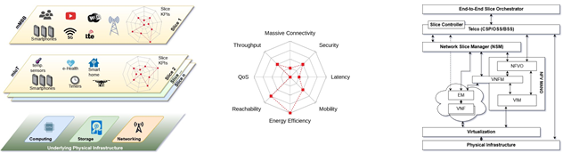

[TOC]

# 缩略语

| 缩写 |               全称               |    中文翻译    |
| :--: | :------------------------------: | :------------: |
| NSM  |      Network Slice Manager       |  网络分片管理  |
| NFV  | Network Functions Virtualization | 网络功能虚拟化 |
| NSI  |     Network Slice Instances      |  网络分片示例  |
| RAN  |       Radio Access Network       |  无线电接入网  |
| BSS  |     Business support system      |  业务支撑系统  |
| OSS  |     Operation support system     |  运营支撑系统  |
| MSS  |    Management Support System     |  管理支撑系统  |

*BSS/OSS又合称**BOSS**: Business and Operation support system*

# Abstract

Network slicing emerges as a key technology in next generation networks, boosted by the integration of software‐defined networking and network functions virtualization. However, while allowing resource sharing among multiple tenants, such networks must also ensure the security requirements needed for the scenarios they are employed. This letter presents the leading security challenges on the use of network slices at the packet core, the solutions that academy and industry are proposing to address them, pointing out some directions that should be considered. This article is protected by copyright. All rights reserved.

# 1. INTRODUCTION

The <u>heterogeneity（异质性）</u> of network services <u>coexisting（共存）</u> in the same infrastructure requires networks to be designed to achieve a multitude of requirements that can be conflicting. Furthermore, such services are very dynamic and subject to unpredictable demands. Additionally, it is expected that networks will reach a much bigger scale in the coming years, mostly driven by the growth of the Internet of Things (IoT). This shift in scale will raise the network demands drastically, including 1000 times more data volume, from 10 to 100 times more devices, 5 times lower latency, and high bit rates per user. These new demands will require higher spectrum efficiency, better coverage, supporting an increasing number of heterogeneous devices, while being <u>cost-effective（成本效益）</u>[^1]. To support this, the concept of Network Slicing arises, allowing network operators to split their physical infrastructure into multiple logical networks, each one <u>orchestrated（被安排）</u> according to its specific characteristics. As depicted in Fig. 1a, each slice represents an independent end-to-end network and can be owned by distinct <u>tenants（租户）</u> (or <u>vertical markets（网络销售）</u>) that control physical, virtualized, and service layers, with distinct Key Performance Indicators (KPIs). Examples of KPIs are Latency, Data Security, Energy Efficiency, Mobility, <u>Massive Connectivity（大规模连接）</u>, Reachability, Quality of Service (QoS), and <u>Throughput（吞吐量）</u>, as illustrated in Fig. 1b.

Taking recent advancements in virtualization and network control, such as Software Defined Networking (SDN) for networking and Network Functions Virtualization (NFV) for function virtualization, network slicing creates virtual networks that deliver a customized network experience <u>tailored（量身订制）</u> to relevant KPIs. The management view, shown in Fig. 1c, illustrates how the orchestration of Network Slices can be done end-to-end by slice’s owners, articulating the different slice-enabled <u>telcos（电信公司）</u> that provide the infrastructure. Inspired by the ETSI[^3], the telco should have a Network Slice Manager (NSM) on top of its NFV orchestration, being the controls of the NSM exposed through the <u>Customer Service Portal（客户服务门户）</u> (CSP) or other interfaces with the OSS/BSS.

While Network Slicing emerges as a key technology for new softwarized networks, including 5G, it also <u>raises security concerns（引起了安全方面的担忧）</u> because of the impact that a vulnerability may have in such scenarios. Because slicing builds <u>atop（在...上面）</u> other technologies, there are known security challenges attributed to the underlying SDN and NFV technologies, as well as the access networks. The goal of this letter is to focus on Network Slicing in a general packet core, <u>conveying（传达）</u> an <u>applied view（应用观点）</u> of the security challenges that arise from the network slicing definition, presenting the existing solutions and possible directions.

**(a)** Business overview  **(b)** Slice KPIs (GSM Alliance[^2])  **(c)**Management architecture(ETSI inspired[^3])

###### **FIGURE 1** The different perspectives of the asset to be secured

# 2. SECURITY ISSUES INTRODUCED BY NETWORK SLICING

<u>Isolation（隔离）</u> is a fundamental feature of Network Slicing. The better the isolation, the more reliable the slicing solution is. A “slicing system” that can only ever have a single slice is actually a regular non-sliced network, i.e., an already well-researched topic. Therefore, by definition, multiple slices will ( at some point) have to coexist by sharing the same infrastructure. This coexistence is determined by the minimum requirements set for each slice. As long as these are delivered, <u>interference does not occur（干扰不会发生）</u>, therefore <u>preserving（保持）</u> isolation. Defining <u>what constitutes interference（什么构成了干扰）</u> for that slice, setting the minimum requirements, and <u>enforcing（实施）</u> them is the critical part of security in network slicing.

Kotulski et al.[^4] state that it is necessary to <u>identify isolation attributes（识别隔离属性）</u>, create a kind of <u>abstraction（抽象）</u> layer to assure end-to-end isolation on a certain strength level, and introduce adequate security policies. In their survey, the authors conclude that currently no common description of isolation capabilities could be used for automatic deployment. Then, it is important to define the expected initial isolation level (*e.g.*, security) as well as designing dynamic isolation mechanisms that can enforce the isolation level of any given service. Our work builds upon this to do a deeper <u>assessment（评估）</u> of Network Slice security challenges in a general packet core, presenting the existing solutions, as well as show future directions (in the form of not addressed issues).

Prominent bodies, such as NGMN, issued recommendations for Network Slicing security in 5G[^5], which <u>aided（帮助）</u> the identification of threats in the general packet core. Recommendations in underlying technologies were also considered, such as ETSI’s for NFV[^6], which surveys the potential areas of security concern across the VNF life-cycle. Because of <u>space constraints（空间限制）</u>, we <u>omit（忽略）</u> 3GPP’s TR 33.811 study of Network Slicing security for 5G, since for our general packet core purposes the NGMN document already <u>covers（涵盖）</u> the same points. Similarly, ETSI NFV-SEC also covers essential aspects of the ONF SDN security whitepaper.

## 2.1 Security Principles on Network Slicing

Each slice has its isolation constraints, which are set by its KPIs. Therefore, interference can be broadly defined as anything that breaks the ability to deliver the KPIs of a given slice. Such interference can be attributed to different origins, *e.g.*, the KPIs may have been poorly selected for the slice application, the service <u>provisioning（供应）</u> may be insufficient to deliver those security-related KPIs, or there may be adversaries who are disrupting services. As a consequence, an effective network slicing solution needs to address management, performance, and security as a whole.

It is crucial that <u>attacks performed against（对...实施的攻击）</u> one slice do not affect the others, therefore requiring that security functions act independently. The NSM must be able to <u>track（追踪）</u> <u>flows（流）</u> and <u>function interactions（功能交互）</u> across slices, within their administrative domains. The NSM is responsible for the abstracted virtual network and interacting functions, within the slice. However, the same NSM is not responsible for the orchestration or correctness of services provided by the slices. Secure network slicing solutions must ensure the main security principles, traditionally categorized into confidentiality, authentication, authorization, availability, and integrity. In such a context, when associated with network slicing, these principles translate:

1. confidentiality: must ensure that packets are not made available outside of the slice that generated them, or the slices which are allowed to interconnect. Additionally, the data carried in those packets or held within the Network Functions (NFs) that process them must not be available to anyone other than the authorized elements or end-users.
2. <u>authentication（身份鉴别）</u>: must <u>unequivocally（毫不含糊地）</u> identify and validate the persons, accounts, or elements that are interacting with the system. When an OSS/BSS interacts with the NSM, both parties must be able to verify and authenticate themselves mutually. The same <u>requirement（需求）</u> <u>applies（适应）</u> to OSS/BSS interactions made on behalf of Slice-Owners, the ones with the Management and Orchestrator (MANO), in order to manage network elements and others triggered by end-users.
3. <u>authorization（授权）</u>: must determine whether an attempted interaction is allowed to go through. End-Users, Slice-Owners, Infrastructure Providers, and elements such aes the NSM or NFs have different capabilities within the system. End-Users may only be allowed to interact with slices that the Slice-Owners have granted access to. Slice-Owners must only manage their own slices, or control the allowed interactions with other slices. Infrastructure Providers must have full control over the NSM and the accounting of slices. The NSM has full control over the Network Slice Instances (NSIs) and their NFs. Lastly, the NFs have control over the resources and data that are provided to tehem.
4. <u>availability（可用性）</u>: the system must be reachable and working as expected when it is required. This means that the NSM and NFs must remain accessible at all time, while the slices and application part of the NFs must be accessible as long as the <u>contracted infrastructure resources（合同基础设施资源）</u> <u>are not exceeded（不超过）</u>. Another important aspect is the processing and response times, which must remain under the <u>threshold（阈值）</u> as specified in the <u>Service Level Agreement（服务水平协议）</u>.
5. <u>integrity（完整性）</u>: the system must not be able to be <u>subverted（遭到破坏）</u>, either by tampering with data or by replacing its functionality. In other words, only Slice-Owners may change the application part of their NFs, define what is the flow processing within the slices, or change the <u>inter-slice configurations（片间配置）</u>. <u>Cross-talk（串扰）</u> between slices cannot be allowed, inter-slice communications must only happen through their <u>respective interfaces（各自的接口）</u>.

The primary challenge when developing a network slicing solution is to fulfill all requirements per the slice owner while ensuring the security of each slice independently. In the next section, we discuss how malicious users can exploit some slicing features in order to defeat the whole system.

## 2.2 Security Threats on Network Slicing

Network slicing relies on assuring a required level of isolation, which depends on the actual requirements of a slice. As the NSM has full control over all telco slices, <u>compromising（损害）</u> the NSM functionality will eventually affect the whole system. If an attacker monitors the traffic in the <u>northbound or southbound interfaces（北向或南向接口）</u>, he/she may be able to understand the configurations performed in the system, <u>breaching（违反）</u> <u>confidentiality（机密性）</u>. This allows the attacker to independently create a snapshot of the system’s status, a vital part of the <u>enumeration phase（枚举阶段）</u> in which all <u>ingress vectors（入口向量）</u> are identified, <u>along with（以及）</u> the possible <u>vulnerabilities（漏洞）</u>. A breach in confidentiality by monitoring these interfaces may quickly <u>escalate（升级）</u> to a breach of <u>authentication（认证）</u> or <u>authorization（授权）</u>, <u>as（因为）</u> the attacker may capture a way to <u>impersonate（模仿）</u> an element or <u>acquire（获得）</u> a token that allows performing some action <u>transiently（暂时地）</u>. 

Also, if the attacker is able to inject traffic into those interfaces, then the system may also have a breach of integrity or availability. The same threats to the NSM’s southbound interface also apply to the MANO’s NFV Orchestrator (NFVO), as both are exposed. The difference in the case of the NFVO is the breadth of its scope, that is, the consequences of a breach/disruption of the NFVO only affect a subset of the elements controlled by the NSM. Unsurprisingly, if an attacker manages to get a <u>foothold（立足点）</u> <u>within the control plane of the operator（在操作员的控制平面内）</u> (as was described above), that has the potential for broader consequences over the system. However, most Network Slice users will be constrained to just the data-plane, being the control-plane only indirectly exposed through well-defined configuration primitives (in the northbound interfaces of both NSM and NFVO). The incorrect validation in the northbound interfaces may allow legitimate users to compromise the system’s integrity.

By itself, the data-plane is void of any configuration capabilities, therefore limiting the attack surface over the system. <u>Notwithstanding（尽管如此）</u>, while that is the definition as in SDN-like networks, in reality, the control-plane is not entirely <u>decoupled（解耦）</u> from the data-plane. The functions in the data-plane usually interact with the southbound interface of their manager (a part of the controlplane), through which the <u>management primitives（管理原语）</u> reconfigure and generally control the NF. <u>Voiding（有效的）</u> data-plane access to the southbound interface partially relies on the function securing itself. Locally-stored credentials to the control-plane capabilities need to be protected by the NF itself. A <u>compromise（折衷）</u> of any of those functions may allow access to control-plane functionality, which would breach the system’s integrity, exposing through the data-plane the same attack vectors of the control-plane.

###### TABLE 1 Threats impact on the Security Principles

|             | Security Threat                | Confidentiality | Integrity | Authentication | Authorization | Availability |
| :---------: | :----------------------------- | :-------------: | :-------: | :------------: | :-----------: | :----------: |
|  Classical  | Monitor interfaces             |        ✓        |           |      (✓)       |      (✓)      |              |
|             | Inject traffic into interfaces |                 |     ✓     |                |               |      ✓       |
|             | NSM impersonation              |       (✓)       |    (✓)    |       ✓        |      (✓)      |     (✓)      |
|             | Host platform impersonation    |       (✓)       |    (✓)    |       ✓        |      (✓)      |     (✓)      |
| Non-trivial | Compromise of the function     |                 |     ✓     |                |               |      ✓       |
|             | Passive side channel           |        ✓        |           |                |               |              |
|             | Active side channel            |        ✓        |     ✓     |                |               |      ✓       |
|             | End devices vulnerabilities    |        ✓        |           |                |       ✓       |      ✓       |

**Legend: empty** – unaffected ✓– Direct Impact (✓) – Immediate Consequences

Due to the nature of shared environments, even if the slice is well behaved and does not allow access to another slice’s data-plane/control-plane, it may still allow establishing side-channels across slices that share resources. In this context, typical side-channels are time-based attacks that leverage various system caches. An example of such an attack is an oracle, which infers data from another slice by introducing in the same (shared) CPU known combinations of data until one is processed faster than the rest, allowing the attacker to infer that such data was already in cache (therefore in another slice). This leads to a breach of confidentiality, with varying levels of severity. The availability (or even integrity) may also be compromised by a side-channel, for instance, a noisy-neighbor whose <u>workload（工作负载）</u> selectively introduces <u>jitter（抖动）</u> in a <u>time-constrained（有时间限制的）</u> service that shares its resources.

We must note that a user may connect <u>simultaneously（同时地）</u> to more than one slice. Nevertheless, end devices <u>are prone to（容易）</u> security vulnerabilities and various kinds of attacks. For example, they can be <u>contaminated（污染）</u> by malware or turned into a bot within a Distributed Denial of Service (DDoS) attack. Also, they are subject to <u>hardware tampering（硬件篡改）</u> or sensor errors. In such a case, it is critical to be aware that compromised end devices may, <u>even unintentionally（尽管不是有意地）</u>, allow inter-slice communication. Thus, some security principles will be <u>violated（违反）</u>: confidentiality, because data from a given slice may flow out to another one via the compromised device; and authorization, whereas unauthorized users may use the affected end-point to access a protected slice. 

On the infrastructure side, the NSM will be responsible for securing the inter-slice communications (when permitted, according to the rules defined for that instance). The successful <u>impersonation（假冒）</u> of the NSM itself would allow to fully <u>subvert（颠覆）</u> the slices isolation, allowing for unauthorized access to other slices. This results in a breach of authentication that could then result in a breach of system integrity and confidentiality. NFs may also serve more than one slice, in which case an exploit of the NF may allow for unauthorized inter-slice communication, breaching the system’s integrity and potentially confidentiality.

In another scenario, an attacker may impersonate the host platforms. In this case, the NSM can be deceived and led to believe that the host platform on which a network slice will run is an operator authorized platform. In such a scenario, an impersonation attack can have significant consequences as operators will <u>expose（暴露）</u> the network and private services within that network to an attacker. This breach impacts the confidentiality, since private data can be revealed, as well as integrity, since data may be corrupted, and availability, since service may be interrupted and data be removed.

An essential factor to take into consideration is that Network Slices will have resource <u>quotas（配额）</u> which a malicious user may try to <u>abuse（滥用）</u>, <u>disrupting（破坏）</u> the service of that single slice (<u>compromising availability（损害可用性）</u>). The malicious user may do so by merely shaping its usage patterns of the slice in a way that is the most expensive for its functions, <u>invalidating（使无效）</u> the previously required resource calculations, forcing the Network Slice to either <u>take more resources（获取更多资源）</u> from the pool or <u>fail to keep with the demand（无法满足需求）</u>. Additionally, NFs that are shared across slices will also run with a limited resource quota. This allows an <u>ill-intentioned（恶意的）</u> user to break isolation and <u>perturb（扰乱）</u> the operation of the other slice by disrupting that shared NF, compromising the system integrity.

Threats are summarized in Table 1, which is divided into two categories, classical and <u>non-trivial（非脆弱威胁）</u>. Classical <u>denotes（代表）</u> <u>well researched（充分研究）</u> and <u>long-standing（长期存在的）</u> threats, common in other network systems. Non-trivial <u>designates（指明）</u> open research topics, in which a clear and general solution is still not available.

# 3.  SECURITY IN NETWORK SLICES

Academy and industry researched the main threats against network slicing and proposed solutions to either solve or <u>mitigate（减轻）</u> the impact of such threats. Table 2 summarizes the key research specific to Network Slicing Security. When the specific research does not address an issue, we resort to the solutions proposed in the <u>broader fields（更广阔的领域）</u> of computing and networking. As such,Table 2 is grouped into three categories: Radio Access Network (RAN)’s slice, Core’s slice, and General Solutions. The first, RAN’s slice, is the specific research that focuses on radio access. Although <u>highly relevant（相关度很高）</u>, works in this field <u>fall outside（超出范围）</u> of the  scope of the packet core. Because of that, their findings are presented only <u>in regards to（有关）</u> their <u>applicability（适用性）</u> to the scope of this letter, which is the packet core. The second, Core’s slice, presents the works that directly <u>fall within（属于）</u> our scope. Lastly, General Solutions address open issues in field-specific research with broader works. 

###### TABLE 2 Network Slicing defenses against the Security Threats

|             |                                |    RAN’s Slice    |                   | Core’s Slice  |                 |                     |                    |  General Solutions  |                      |
| :---------: | :----------------------------- | :---------------: | :---------------: | :-----------: | :-------------: | :-----------------: | :----------------: | :-----------------: | :------------------: |
|             | Security Threat                | Mareca et al.[^7] | Bordel et al.[^8] | Ni et al.[^9] | Liu et al.[^10] | Ehrlich et al.[^11] | Kotuski et al.[^4] | Canella et al.[^12] | Hutchins et al.[^13] |
|  Classical  | Monitor interfaces             |         ✗         |        ✓✓         |      ✓✓✓      |       ✓✓✓       |         ✓✓          |         ✓          |          ✗          |          ✗           |
|             | Inject traffic into interfaces |         ✗         |         ✗         |      ✓✓✓      |       ✓✓✓       |         ✓✓          |         ✓          |          ✗          |          ✗           |
|             | NSM impersonation              |         ✗         |         ✗         |      ✓✓✓      |       ✓✓✓       |         ✓✓          |         ✓          |          ✗          |          ✗           |
|             | Host platform impersonation ✗  |         ✗         |         ✗         |      ✓✓✓      |       ✓✓✓       |         ✓✓          |         ✓          |          ✗          |          ✗           |
| Non-trivial | Compromise of the function     |         ✗         |         ✗         |       ✗       |        ✗        |          ✗          |         ✗          |          ✗          |          ✓✓          |
|             | Passive side channel           |         ✗         |         ✗         |       ✗       |        ✗        |          ✗          |         ✗          |          ✓          |          ✗           |
|             | Active side channel            |         ✗         |         ✗         |       ✗       |        ✗        |          ✗          |         ✗          |          ✓          |          ✗           |
|             | End devices vulnerabilities    |         ✗         |         ✗         |       ✗       |        ✗        |          ✗          |         ✗          |          ✗          |          ✓✓          |

**Legend**: ✗– Not applicable ✓– Describes or References ✓✓– Applicable methods or controls ✓✓✓– Directly addresses issue

Mareca et al.[^7]and Bordel et al.[^8] proposed solutions to protect data flow between end devices and the base stations. Both solutions consider only RAN and, as a consequence, do not address the issues that threaten core slices. The former employed chaos-based cryptography for privacy preservation, which relied on the actual radio signal and properties of media access, therefore hard to apply to the packet core. The latter proposed a stream cipher to protect intra-slice communications, based on a simple lightweight <u>pseudo（伪）</u>-random number generator. Dubbed as the Trifork[^14] , it may be used in <u>resource-constrained（资源受限）</u> devices as it requires lower computational power. Unlike Mareca et al., this approach may <u>be ported to（移植到）</u> be used in the packet core.

There are also some solutions that addressed security in core slicing [^9][^10][^11] . Thus, such solutions are more suitable to protect against the threats discussed in the previous section. Ni et al.[^9]presented ES[^3]A, an efficient and secure <u>service-oriented（服务至上）</u> authentication framework supporting network slicing for 5G-enabled IoT services. By using ES[^3]A, users can establish connections with the 5G core network and anonymously access IoT services under their delegation through proper network slices. Also,users’ privacy is ensured in terms of slice configuration and access. Authors employed group signatures to provide anonymous service-oriented authentication. In addition, session keys, based on Diffie-Hellman key agreement, are employed to guarantee secure access to service data. As a result, all the classical threats are directly addressed by the solution.

Cryptography is also employed to protect inter-slice communication. Liu et al.[^10] proposed a <u>mutual（相互）</u> <u>heterogeneous（异构）</u> <u>signcryption（签密）</u> scheme to ensure the secure communications between 5G network slices, in different public crypto systems – Public Key Infrastructure (PKI) and CertificateLess Cryptography (CLC). The authors present a scenario in which users of a 5G Mobile Internet slice, using a PKI, want to securely communicate with users of a 5G Vehicle Internet slice, using a CLC. The solution is more efficient than the traditional signature-than-encrypt approach, in which a user first signs a message and then encrypts it before sending to another user. This allows secure communication between two slices using different cryptography techniques. As Ni et al. framework, the security schema proposed by Liu et al. protects the Network Slice against the classical threats.

Ehrlich et al.[^11] approached the security controls required for core slicing addressing, in particular, the classical threats. The authors propose a dynamic, machine-readable, automatic, continuous, and <u>future-proof（永不过时的）</u> approach to model and describe cyber-security QoS requirements to support network slicing on SDN. They assess what is essential to describe and map non-functional QoS requirements of cyber security to the 5G Network Slices paradigms. The ISO/IEC 62443 security standard was used to model and describe the cyber security maturity of the high-level application requirements and the underlying networking capabilities in order to support network management. Seven Foundational Requirements (FRs) are evaluated with four predefined Security Levels (SLs), which results in a numerical specification of the cyber-security maturity of the given application requirements or networking capabilities.

Finally, Kotulski et al.[^4]discuss a dynamic isolation <u>mechanism（机制）</u> that creates isolated resources with proper capabilities, which also addresses inter-slicing communication with shared virtual resources across slices without breaching global security policy rules. Although the proposed tasks cover a wide range of issues related to secure network slicing, they do not present solutions to address security issues directly. <u>Nonetheless（尽管如此）</u>, the authors describe some ways to meet secure environments.

Note that neither solutions that consider only RAN nor those that consider core slicing address the non-trivial threats. As stated, non-trivial threats are still open issues that need more attention. However, it is assumed that general security solutions of other environments may be transposed to network slice scenarios. For instance, Canella et al.[^12] describe different types of <u>Spectre and Meltdown attacks（幽灵和熔毁攻击）</u>, an architectural side-channel that affects many CPUs. While not directly surveyed within Network Slicing, the findings are highly relevant for <u>shared（共享的）</u> <u>softwarized and virtualized（软件和虚拟化）</u> environments, such as those used by NFV and SDN. Lockheed Martin[^13] characterized the network attack process, which would later be known as the “Cyber Kill Chain.” This methodology is readily applicable to NFs that take part of the slice, being also relevant to define the controls needed in the end-user terminals.

# 4. CONCLUSION

We have briefly reviewed the most pressing challenges of Network Slicing Security, in the scope of the general packet core networks. The gathered challenges can be classified as classical and non-trivial. The classical challenges are already addressed in some form, as they encompass well-researched topics, such as mutual authentication protocols, encryption mechanisms,and data integrity/authentication measures. We were able to find research already in the field of Network Slicing Security that delivered solutions to these classical challenges. On the other hand, non-trivial issues, such as avoiding the compromise of a network function, defending against side-channels, or dealing with end-devices vulnerabilities, still lack research that addressed the needs of Network Slicing. In fact, side-channel attacks such as Spectre and Meltdown still have open issues in the broader sense of general computing, with new (unmitigated) variants of the attack still being discovered. Nevertheless, challenges such as avoiding the compromise of a network function or dealing with end-devices vulnerabilities may be addressable employing the same methodology of general computing/networking (for instance, the “Cyber Kill Chain”). While it still lacks the <u>holistic（整体）</u> approach that allows for the integration with the different components that make a Network Slicing system, future research may build upon the methodology, unlocking more efficient solutions that are aware of the KPIs and the <u>ramifications（庆祝活动）</u> of the resource sharing in these softwarized and virtualized environments.

# ACKNOWLEDGMENT

Supported by the FEDER, through COMPETE 2020 of the Portugal 2020 framework [Project Smart EnterCom with Nr. 021949],and by FCT/MEC [Project 5GCONTACT PTDC/EEI-TEL/30685/2017].

[^1]:Afzal M K, Zikria Y B, Mumtaz S, et al. Unlocking 5G spectrum potential for intelligent IoT: Opportunities, challenges, and solutions[J]. IEEE Communications Magazine, 2018, 56(10): 92-93.
[^2]:Alliance G S M. An Introduction to Network Slicing[J]. White Paper, 2017.
[^3]:Galis A, Makhijani K. Network Slicing Landscape: A holistic architectural approach, orchestration and management with applicability in mobile and fixed networks and clouds[J]. 2018.
[^4]:Kotulski Z, Nowak T W, Sepczuk M, et al. Towards constructive approach to end-to-end slice isolation in 5G networks[J]. EURASIP Journal on Information Security, 2018, 2018(1): 2.
[^5]:NGMN Alliance . 5G Security Recommendations Package #2: Network Slicing. NGMN 2016.
[^6]:ETSI NFV. Network Functions Virtualisation (NFV); NFV Security; Problem Statement. ETSI GS NFV-SEC-001 2014.
[^7]:7. Mareca P, Bordel B. An Intra-Slice Chaotic-based Security Solution for Privacy Preservation in Future 5G Systems. In: A. Rocha and H. Adeli and L. Reis and S. Costanzo, eds. Advances in Intelligent Systems and Computing. 746. Springer, Cham. 2018 (pp. 144–154)
[^8]:8. Bordel B, Orue AB, Alcarria R, Rivera S.-dD. An Intra-Slice Security Solution for Emerging 5G Networks Based on Pseudo-Random Number Generators. IEEE Access 2018; 6(March): 16149–16164.
[^9]:9. Ni J, Lin X, Shen X. Efficient and Secure Service-oriented Authentication Supporting Network Slicing for 5G-enabled IoT. IEEE Journal on Selected Areas in Communications 2018.
[^10]:10. Liu J, Zhang L, Sun R, Du X, Guizani M. Mutual Heterogeneous Signcryption Schemes for 5G Network Slicings. IEEE Access 2018; 6: 7854–7863.
[^11]:11. Ehrlich M, Wisniewski L, Trsek H, Mahrenholz D, Jasperneite J. Automatic Mapping of Cyber Security Requirements to Support Network Slicing in Software-defined Networks. In: Proceedings of the 22nd IEEE ETFA. IEEE Industrial Electronics Society; 2017; Limassol, Cyprus 
[^12]:12. Canella C, Van Bulck J, Schwarz M, et al. A Systematic Evaluation of Transient Execution Attacks and Defenses. arXiv 1811.05441, 2018.
[^13]:Hutchins EM, Cloppert MJ, Amin RM. Intelligence-Driven Computer Network Defense Informed by Analysis of Adversary Campaigns and Intrusion Kill Chains. Proceedings of the 6th International Conference on Information Warfare and Security 2011. 
[^14]:14. Orue AB, Montoya F, Encinas LH. Trifork, a New Pseudorandom Number Generator Based on Lagged Fibonacci Maps. Journal of Computer Science and Engeenering 2010; 2(2): 46–51.