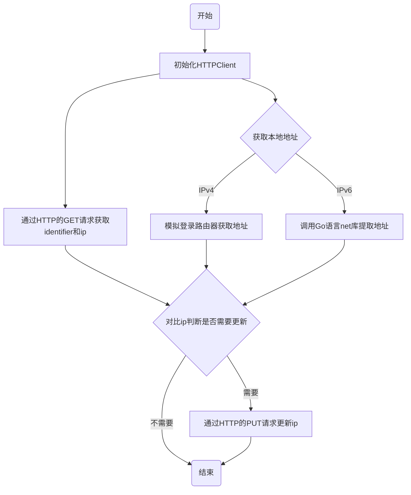

# 功能

- [x] 调用Cloudflare（下称CF）API查询域名对应的identifier和ip
- [x] 查询本地2001段IPv6地址
- [x] 通过爬虫查询路由器中的10.173段IPv4地址
- [x] 对比ip判断是否需要调用CF的API更新ip
- [x] 在Windows上设置任务计划，定时执行二进制文件

# 网络信息说明

- 实验室路由器翼讯拨号，路由器分配`10.173`段内网IPv4地址，做端口转发。电脑被分配`192.168`段地址，但这个内网不是我想要的地址。
- 直连校园网，被分配`2001`段IPv6地址。

# 代码结构

```go
// 初始化http请求的client端以复用
func initiateHttpClient() *http.Client {}

// 通过HTTP的GET请求获取identifier和ip
func getIdentifierAndIp(name string, dnsType string, httpClient *http.Client) (identifier string, ip string, err error) {}

// 获取本机的IPv4和IPv6地址
func getNativeIp(ipType string) (ip string, err error) {}

// 检查ip是否需要更新
func checkIp(identifier string, ip string, ipType string, httpClient *http.Client) (nativeIp string, updateFlag bool) {}

// 通过HTTP的PUT请求更新ip
func updateCloudflareDns(identifier string, name string, dnsType string, ip string, httpClient *http.Client) (err error) {}

// 程序入口
func main() {}
```

# 工作流程




# Cloudflare的API中涉及的几个参数

## AccountID - 用户ID


## ZoneID - 域名ID


## identifier - 子域名ID

可通过`GET`请求获得，参考`getIdentifierAndIp`函数部分

## API-Key


# 设置Win10任务计划定时执行程序

## 常规设置


## 新建触发器


## 新建操作


## 设置


## 启用所有任务历史记录


刚开始设置计划任务后，除非以手动点击的方式程序才会运行一次后一直处在“准备就绪”的状态，其他时间即使过了所设置的时间点，任务也不会执行。在与[@caibaoafeizai](https://github.com/canbaoafeizai)一起研究几十分钟后，貌似在打开第五步的“启用所有任务历史记录”后正常了，具体原因我们也没排查出来，汗...

# 值得注意的点

1. HTTP的请求方式全部为大写，如`GET` `POST` `PUT` `HEAD`。代码中我受Go语言本身的影响，一个地方把`GET`写成了`Get`（Go的命名方式一般为可外调函数的首字母大写），CF请求总是返回`400`，错误排查了我半个小时...
2. 获取本机IPv4的方式为模拟登录路由器管理页面获取内容，获取本机IPv6的方式为调用Go语言net库提取地址。
3. 实验室路由器`产品型号：TL-WDR7660千兆版`，登陆未使用`cookie`机制，而是在模拟登录后返回一个`stok`，后续可通过在url中加入这个参数获取内容。且获取路由器工作信息的方式为向http://192.168.1.1/stok=XXX/ds `POST`一个body为`{"network":{"name":["wan_status"]},"method":"get"}`的数据，返回信息为`json`格式的结果。

# 代码部分

因代码主要功能为自用，就不单独上传Github仓库了

```go
package main

import (
	"bytes"
	"encoding/json"
	"fmt"
	"io/ioutil"
	"log"
	"net"
	"net/http"
	"net/http/cookiejar"
	"regexp"
	"strings"

	"github.com/tidwall/gjson"
)

const (
	ZONE_IDENTIFIER = "XXX"
	XAuthEmail      = "XXX"
	XAuthKey        = "XXX"
)

// 初始化http请求的client端以复用
func initiateHttpClient() *http.Client {
	client := &http.Client{}
	return client
}

// 通过HTTP的GET请求获取identifier和ip
func getIdentifierAndIp(name string, dnsType string, httpClient *http.Client) (identifier string, ip string, err error) {
	dnsRecordsListUrl := fmt.Sprintf("https://api.cloudflare.com/client/v4/zones/%s/dns_records?name=%s.littleghost.ml&type=%s", ZONE_IDENTIFIER, name, dnsType)
	request, err := http.NewRequest("GET", dnsRecordsListUrl, nil) // 写的时候GET写成了Get，导致网页返回400，排除错误用了我半个小时...
	if err != nil {
		log.Print(err)
		return "", "", err
	}

	request.Header.Add("X-Auth-Email", XAuthEmail)
	request.Header.Add("X-Auth-Key", XAuthKey)
	request.Header.Add("Content-Type", "application/json")

	response, err := httpClient.Do(request)
	if err != nil {
		log.Print(err)
		return "", "", err
	}

	defer response.Body.Close()

	body, err := ioutil.ReadAll(response.Body)
	if err != nil {
		log.Print(err)
		return "", "", err
	}

	result := gjson.Get(string(body), "result").Array()[0].String() // 结果是gjson.Result
	id := gjson.Get(result, "id").String()
	ip = gjson.Get(result, "content").String()

	return id, ip, nil
}

// 获取本机的IPv4和IPv6地址
func getNativeIp(ipType string) (ip string, err error) {
	if ipType == "ipv4" {

		jar, _ := cookiejar.New(nil)
		httpClient := &http.Client{
			Jar: jar,
		}
		loginUrl := "http://192.168.1.1/"
		req, _ := http.NewRequest("POST", loginUrl, strings.NewReader(`{"method":"do","login":{"password":"XXX"}}`))
		res, httpError := httpClient.Do(req)
		if httpError != nil {
			log.Print(httpError)
			err = httpError
		}

		defer res.Body.Close()

		body, _ := ioutil.ReadAll(res.Body)
		stok := gjson.Get(string(body), "stok").String()

		contentUrl := fmt.Sprintf("http://192.168.1.1/stok=%s/ds", stok)
		req, _ = http.NewRequest("POST", contentUrl, strings.NewReader(`{"network":{"name":["wan_status"]},"method":"get"}`))
		res, httpError = httpClient.Do(req)
		if httpError != nil {
			log.Print(httpError)
			err = httpError
		}
		
		defer res.Body.Close()

		body, _ = ioutil.ReadAll(res.Body)
		ip = gjson.Get(string(body), "network").Get("wan_status").Get("ipaddr").String()

		return ip, nil
	} else if ipType == "ipv6" {
		addrs, err := net.InterfaceAddrs()
		if err != nil {
			fmt.Println(err)
			return "", err
		}
		for _, address := range addrs {
			ipnet, ok := address.(*net.IPNet)
			if ok && !ipnet.IP.IsLoopback() {
				ip = ipnet.IP.String()
				matchFlag, err := regexp.MatchString("2001", ip)
				if err != nil {
					fmt.Println(err)
					return "", err
				}
				if ip != "" && matchFlag {
					break
				}
			}
		}
	}
	return ip, nil
}

// 检查ip是否需要更新
func checkIp(identifier string, ip string, ipType string, httpClient *http.Client) (nativeIp string, updateFlag bool) {
	if ipType == "ipv4" {
		nativeIpv4, err := getNativeIp("ipv4")
		if err != nil {
			fmt.Println(err)
			updateFlag = false
		}
		if ip != nativeIpv4 {
			nativeIp = nativeIpv4
			updateFlag = true
		}
	} else if ipType == "ipv6" {
		nativeIpv6, err := getNativeIp("ipv6")
		if err != nil {
			fmt.Println(err)
			updateFlag = false
		}

		if ip != nativeIpv6 {
			nativeIp = nativeIpv6
			updateFlag = true
		}
	}
	return
}

// 通过HTTP的PUT请求更新ip
func updateCloudflareDns(identifier string, name string, dnsType string, ip string, httpClient *http.Client) (err error) {
	type updateDnsPostForm struct {
		Name    string `json:"name"`
		DnsType string `json:"type"`
		Content string `json:"content"`
		Ttl     int    `json:"ttl"`
		Proxied bool   `json:"proxied"`
	}

	updateDnsUrl := fmt.Sprintf("https://api.cloudflare.com/client/v4/zones/%s/dns_records/%s", ZONE_IDENTIFIER, identifier)

	postForm := updateDnsPostForm{
		Name:    name,
		DnsType: dnsType,
		Content: ip,
		Ttl:     1,
		Proxied: false,
	}

	postBody, err := json.Marshal(postForm)
	if err != nil {
		log.Print(err)
		return err
	}
	request, err := http.NewRequest("PUT", updateDnsUrl, bytes.NewBuffer(postBody))
	if err != nil {
		log.Print(err)
		return err
	}

	request.Header.Add("X-Auth-Email", XAuthEmail)
	request.Header.Add("X-Auth-Key", XAuthKey)
	request.Header.Add("Content-Type", "application/json")

	response, err := httpClient.Do(request)
	if err != nil {
		log.Print(err)
		return err
	}

	defer response.Body.Close()

	body, err := ioutil.ReadAll(response.Body)
	if err != nil {
		log.Print(err)
		return err
	}

	fmt.Println(string(body))
	return nil
}

// 程序入口
func main() {
	httpClient := initiateHttpClient()
	identifier, ip, err := getIdentifierAndIp("lab6", "AAAA", httpClient)
	if err != nil {
		fmt.Println("Can't get identifier")
		return
	}
	nativeIp, updateFlag := checkIp(identifier, ip, "ipv6", httpClient)
	if updateFlag {
		updateCloudflareDns(identifier, "lab6", "AAAA", nativeIp, httpClient)
	}

	identifier, ip, err = getIdentifierAndIp("lab", "A", httpClient)
	if err != nil {
		fmt.Println("Can't get identifier")
		return
	}
	nativeIp, updateFlag = checkIp(identifier, ip, "ipv4", httpClient)
	if updateFlag {
		updateCloudflareDns(identifier, "lab", "A", nativeIp, httpClient)
	}
}

```


